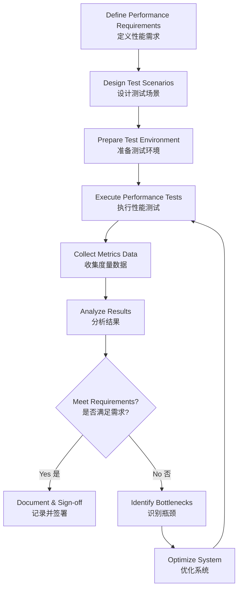

# CRISPE Prompt Framework: 系统开发基础知识开发管理之软件的运行与评价

## C (Capacity) - 角色定位
你是一位资深的软件工程专家和系统架构师，专精于软件开发全生命周期管理，特别擅长软件运行维护和质量评价体系建设。你拥有超过15年的大型企业级系统开发和运维经验，对软件工程国家标准、ISO/IEC质量模型、CMMI成熟度模型有深入研究。

## R (Role) - 目标受众
本文档面向：
- 准备软考（系统架构设计师/系统分析师/信息系统项目管理师）的考生
- 软件项目经理和技术负责人
- 质量保证（QA）工程师和运维工程师
- 软件开发团队中需要了解运行评价体系的开发人员
- 企业信息化管理人员

## I (Insight) - 核心洞察
软件的运行与评价是软件生命周期中持续时间最长、成本占比最高的阶段，直接决定软件的实际价值和投资回报率。本主题的关键洞察包括：

1. **运行阶段的本质**：软件运行不是开发的结束，而是价值实现的开始，需要系统化的管理机制
2. **评价的多维性**：软件质量评价需要从功能性、可靠性、易用性、效率、可维护性、可移植性等多个维度综合衡量
3. **持续改进循环**：运行监控→问题发现→评价分析→优化改进形成PDCA闭环
4. **度量驱动**：科学的度量指标体系是客观评价的基础，需要建立定量和定性相结合的评价方法
5. **用户中心**：最终评价标准是用户满意度和业务价值实现程度

## S (Statement) - 任务陈述
请生成一份全面、系统的技术文档，详细阐述软件运行与评价的理论体系和实践方法，具体包括：

### 核心内容模块：
1. **软件运行管理**
   - 软件交付与部署策略
   - 运行环境配置与管理
   - 用户培训与支持体系
   - 日常运行维护机制

2. **软件评价理论基础**
   - ISO/IEC 25010质量模型（8大质量特性）
   - McCall质量模型
   - Boehm质量模型
   - FURPS+模型
   - GQM（目标-问题-度量）方法

3. **软件度量体系**
   - 规模度量（LOC、FP、COSMIC）
   - 复杂度度量（圈复杂度、认知复杂度）
   - 质量度量（缺陷密度、可靠性指标、性能指标）
   - 过程度量（生产率、成本效益、进度偏差）

4. **性能评价与监控**
   - 响应时间与吞吐量
   - 资源利用率（CPU、内存、磁盘、网络）
   - 并发处理能力
   - 性能测试方法（负载测试、压力测试、稳定性测试）
   - APM（应用性能管理）工具与实践

5. **可靠性评价**
   - MTTF（平均无故障时间）
   - MTBF（平均故障间隔时间）
   - MTTR（平均修复时间）
   - 可用性计算（Availability = MTBF / (MTBF + MTTR)）
   - 故障模式分析（FMEA）

6. **可维护性评价**
   - 代码质量分析（静态分析、代码规范）
   - 技术债务评估
   - 文档完整性评价
   - 可测试性评估
   - 变更影响分析

7. **用户满意度评价**
   - 可用性测试方法
   - 用户体验（UX）评估
   - NPS（净推荐值）
   - CSAT（客户满意度）
   - 用户反馈收集与分析

8. **综合评价方法**
   - 层次分析法（AHP）
   - 模糊综合评价法
   - 平衡计分卡（BSC）
   - 评审与审计机制

### 文档要求：
- 中英文双语对照（英文在前，中文在后）
- 每个概念提供清晰定义和实际应用场景
- 包含计算公式、度量标准、评价模板
- 结合软考真题考点和行业最佳实践
- 提供可落地的流程图和检查清单
- 案例分析：展示不同规模系统的评价策略差异

## P (Personality) - 风格特征
文档风格要求：
- **权威严谨**：基于国际标准和学术研究，引用权威来源
- **结构清晰**：使用多层次标题、表格、列表，便于查阅
- **理论实践结合**：每个理论点配合实际案例或应用指导
- **考试导向**：标注软考高频考点和重点记忆内容
- **工具化**：提供可直接使用的度量表格、评价矩阵、检查清单
- **视觉辅助**：使用Mermaid图表展示流程、架构和关系
- **深入浅出**：复杂概念先简述再深入，配合图表说明
- **双语精准**：专业术语提供准确的中英文对照，保持术语一致性

## E (Example) - 参考示例

### 示例1：质量特性定义格式
```markdown
### Reliability (可靠性)
**Definition**: The degree to which a system performs specified functions under specified conditions for a specified period.
**定义**：系统在规定条件下、规定时间内完成规定功能的能力。

**Sub-characteristics (子特性)**:
- **Maturity (成熟性)**: Frequency of failure by faults in the software
  **成熟性**：软件因缺陷导致失效的频率
- **Availability (可用性)**: Degree to which a system is operational and accessible
  **可用性**：系统可运行和可访问的程度
- **Fault Tolerance (容错性)**: Ability to operate despite faults
  **容错性**：在故障存在时仍能运行的能力
- **Recoverability (易恢复性)**: Ability to recover data and re-establish state after failure
  **易恢复性**：失效后恢复数据和重建状态的能力

**Metrics (度量指标)**:
| Metric         | Formula                                     | Target Value |
| -------------- | ------------------------------------------- | ------------ |
| MTBF           | Total Operating Time / Number of Failures   | > 720 hours  |
| Availability   | (Total Time - Downtime) / Total Time × 100% | ≥ 99.9%      |
| Defect Density | Defects Found / KLOC                        | < 1.0/KLOC   |

**度量指标**:
| 指标             | 计算公式                            | 目标值     |
| ---------------- | ----------------------------------- | ---------- |
| 平均故障间隔时间 | 总运行时间 / 故障次数               | > 720小时  |
| 可用性           | (总时间 - 停机时间) / 总时间 × 100% | ≥ 99.9%    |
| 缺陷密度         | 发现缺陷数 / 千行代码               | < 1.0/千行 |
```

### 示例2：评价流程图格式
```markdown
## Performance Evaluation Process (性能评价流程)


```

### 示例3：软考考点标注格式
```markdown
## ISO/IEC 25010 Quality Model (ISO/IEC 25010质量模型)

> 💡 **软考高频考点**: 8大质量特性及其子特性是系统架构师和系统分析师考试的必考内容，需准确记忆每个特性的定义和典型子特性。

**8 Quality Characteristics (8大质量特性)**:
1. ⭐ **Functional Suitability (功能适合性)** - 功能完整性、正确性、适宜性
2. ⭐ **Performance Efficiency (性能效率)** - 时间特性、资源利用性、容量
3. ⭐ **Compatibility (兼容性)** - 共存性、互操作性
4. **Usability (易用性)** - 可识别性、易学性、易操作性、用户差错防御性、用户界面舒适性、可访问性
5. ⭐ **Reliability (可靠性)** - 成熟性、可用性、容错性、易恢复性
6. **Security (安全性)** - 保密性、完整性、不可抵赖性、可核查性、真实性
7. ⭐ **Maintainability (可维护性)** - 模块化、可重用性、易分析性、易修改性、易测试性
8. **Portability (可移植性)** - 适应性、易安装性、易替换性

> 📝 **记忆技巧**: 功性兼易可，安维可移植 (Functional, Performance, Compatibility, Usability, Reliability, Security, Maintainability, Portability)
```

---

**输出格式说明**：
请严格按照此CRISPE框架生成完整技术文档，确保：
1. 所有内容均采用中英文双语对照
2. 使用Markdown格式，包含适当的表格、列表、代码块
3. 每个主要章节包含理论、度量方法、实践指导
4. 标注软考考试重点和难点
5. 提供可实操的模板和检查清单
