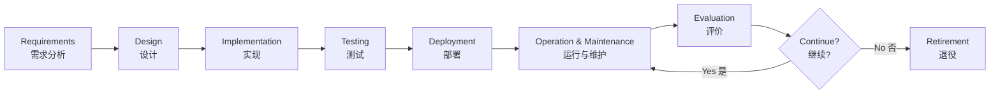
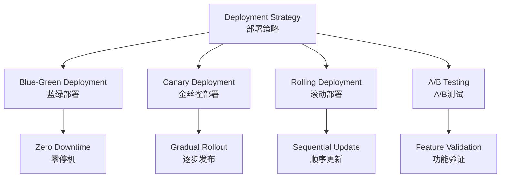
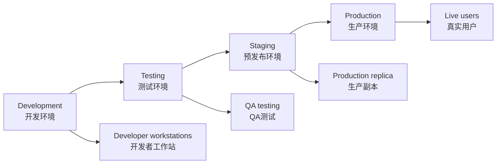
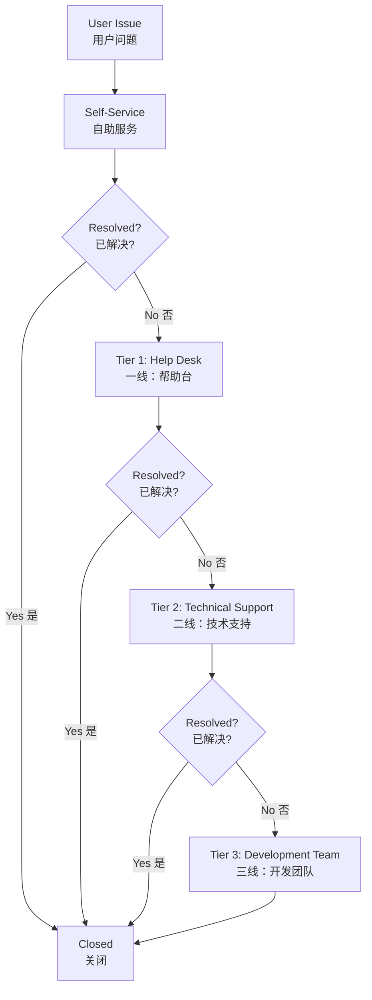
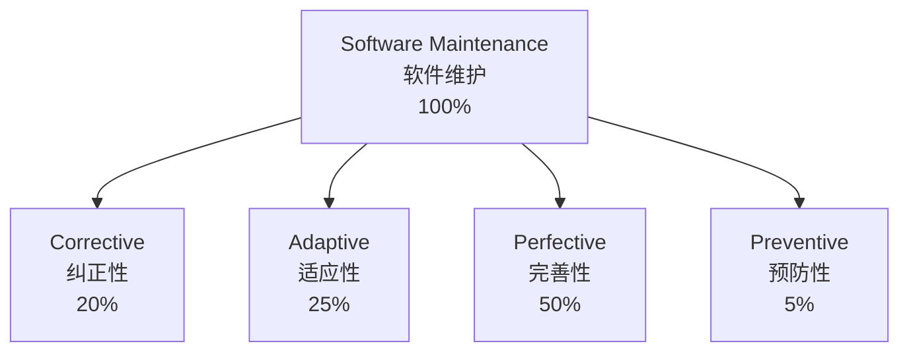
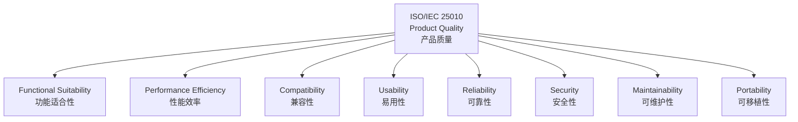
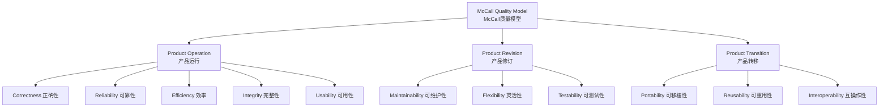
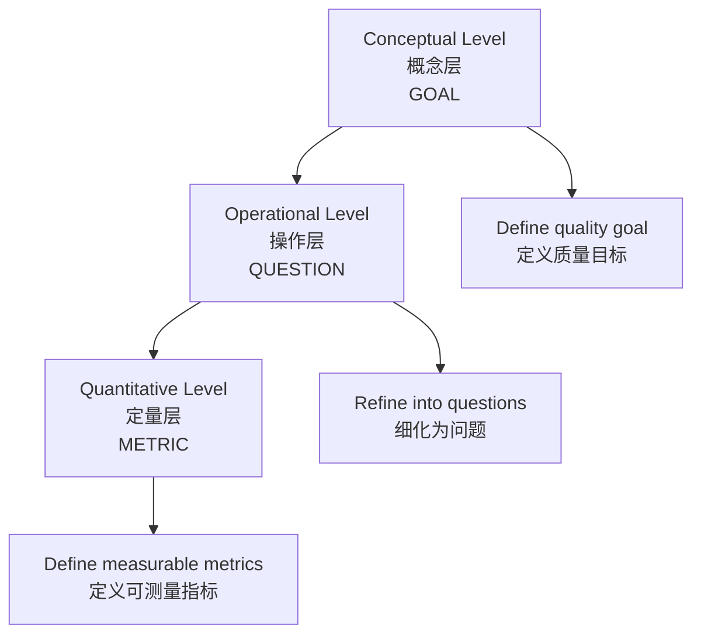

# Software Operation and Evaluation - Technical Documentation
# 软件的运行与评价 - 技术文档

---

## Table of Contents | 目录

1. [Overview | 概述](#overview--概述)
2. [Software Operation Management | 软件运行管理](#software-operation-management--软件运行管理)
3. [Software Quality Evaluation Theory | 软件质量评价理论](#software-quality-evaluation-theory--软件质量评价理论)
4. [Software Metrics System | 软件度量体系](#software-metrics-system--软件度量体系)
5. [Performance Evaluation and Monitoring | 性能评价与监控](#performance-evaluation-and-monitoring--性能评价与监控)
6. [Reliability Evaluation | 可靠性评价](#reliability-evaluation--可靠性评价)
7. [Maintainability Evaluation | 可维护性评价](#maintainability-evaluation--可维护性评价)
8. [User Satisfaction Evaluation | 用户满意度评价](#user-satisfaction-evaluation--用户满意度评价)
9. [Comprehensive Evaluation Methods | 综合评价方法](#comprehensive-evaluation-methods--综合评价方法)
10. [Checklists and Templates | 检查清单与模板](#checklists-and-templates--检查清单与模板)

---

## Overview | 概述

### Introduction | 简介

**Software Operation and Evaluation** is a critical phase in the software development lifecycle (SDLC) that occurs after deployment and continues throughout the software's operational life. This phase typically consumes 60-80% of the total software lifecycle cost and directly determines the return on investment (ROI) and user value realization.

**软件的运行与评价**是软件开发生命周期（SDLC）中的关键阶段，发生在部署之后并贯穿软件的整个运营生命周期。这一阶段通常消耗软件生命周期总成本的60-80%，并直接决定投资回报率（ROI）和用户价值实现。

### Key Characteristics | 关键特征

| Characteristic | Description                                            |
| -------------- | ------------------------------------------------------ |
| **Duration**   | Longest phase in SDLC (years to decades)               |
| **Cost Ratio** | 60-80% of total lifecycle cost                         |
| **Scope**      | Maintenance, monitoring, optimization, user support    |
| **Objective**  | Ensure continuous value delivery and quality assurance |

| 特征         | 描述                           |
| ------------ | ------------------------------ |
| **持续时间** | SDLC中最长阶段（数年至数十年） |
| **成本占比** | 占生命周期总成本的60-80%       |
| **范围**     | 维护、监控、优化、用户支持     |
| **目标**     | 确保持续价值交付和质量保证     |

### SDLC Operation Phase | SDLC运行阶段



> 💡 **软考高频考点**: 软件生命周期各阶段的成本分布，运行维护阶段成本占比最高（60-80%）是常考知识点。

---

## Software Operation Management | 软件运行管理

### 1. Software Delivery and Deployment | 软件交付与部署

#### 1.1 Deployment Strategies | 部署策略

**Big Bang Deployment (一次性部署)**
- **Definition**: Replace the old system entirely with the new system at a specific point in time
- **定义**：在特定时间点将旧系统完全替换为新系统

**Advantages | 优势**:
- Simple and straightforward | 简单直接
- Lower deployment cost | 部署成本较低

**Disadvantages | 劣势**:
- High risk | 高风险
- No rollback option | 无回滚选项
- Significant business disruption | 业务中断影响大

**Phased Deployment (分阶段部署)**
- **Definition**: Gradually replace system modules or functions in stages
- **定义**：分阶段逐步替换系统模块或功能

**Parallel Deployment (并行部署)**
- **Definition**: Run both old and new systems simultaneously for a period
- **定义**：新旧系统同时运行一段时间

**Pilot Deployment (试点部署)**
- **Definition**: Deploy to a subset of users or locations first
- **定义**：首先部署到部分用户或地点

**Modern Deployment Patterns | 现代部署模式**:



**Deployment Strategy Comparison | 部署策略对比**:

| Strategy   | Downtime | Risk   | Rollback Speed | Cost   | Use Case                  |
| ---------- | -------- | ------ | -------------- | ------ | ------------------------- |
| Big Bang   | High     | High   | N/A            | Low    | Small systems             |
| Phased     | Medium   | Medium | Medium         | Medium | Medium systems            |
| Blue-Green | Zero     | Low    | Instant        | High   | Critical systems          |
| Canary     | Zero     | Low    | Fast           | Medium | Production validation     |
| Rolling    | Minimal  | Medium | Medium         | Medium | Large distributed systems |

| 策略       | 停机时间 | 风险 | 回滚速度 | 成本 | 使用场景       |
| ---------- | -------- | ---- | -------- | ---- | -------------- |
| 一次性部署 | 高       | 高   | 不适用   | 低   | 小型系统       |
| 分阶段部署 | 中等     | 中等 | 中等     | 中等 | 中型系统       |
| 蓝绿部署   | 零       | 低   | 即时     | 高   | 关键系统       |
| 金丝雀部署 | 零       | 低   | 快速     | 中等 | 生产验证       |
| 滚动部署   | 最小     | 中等 | 中等     | 中等 | 大型分布式系统 |

> ⭐ **软考考点**: 各种部署策略的特点、适用场景和优缺点对比是系统架构设计师考试的重点内容。

#### 1.2 Deployment Checklist | 部署检查清单

**Pre-Deployment Checklist | 部署前检查清单**:

- [ ] **Environment Verification | 环境验证**
  - [ ] Hardware resources (CPU, Memory, Disk, Network) | 硬件资源
  - [ ] Operating system and patches | 操作系统和补丁
  - [ ] Database version and configuration | 数据库版本和配置
  - [ ] Network connectivity and firewall rules | 网络连接和防火墙规则

- [ ] **Software Preparation | 软件准备**
  - [ ] Build verification | 构建验证
  - [ ] Configuration files | 配置文件
  - [ ] Database migration scripts | 数据库迁移脚本
  - [ ] Dependencies and libraries | 依赖项和库

- [ ] **Backup Strategy | 备份策略**
  - [ ] Database backup | 数据库备份
  - [ ] Configuration backup | 配置备份
  - [ ] Code version tagging | 代码版本标记
  - [ ] Rollback plan | 回滚计划

- [ ] **Testing Verification | 测试验证**
  - [ ] All tests passed | 所有测试通过
  - [ ] Performance testing completed | 性能测试完成
  - [ ] Security scanning completed | 安全扫描完成
  - [ ] User acceptance testing (UAT) approved | 用户验收测试批准

- [ ] **Communication | 沟通**
  - [ ] Stakeholder notification | 干系人通知
  - [ ] Deployment schedule communicated | 部署计划沟通
  - [ ] Support team on standby | 支持团队待命
  - [ ] User notification (if downtime) | 用户通知（如有停机）

### 2. Operating Environment Management | 运行环境管理

#### 2.1 Environment Configuration | 环境配置

**Environment Types | 环境类型**:



**Environment Management Best Practices | 环境管理最佳实践**:

1. **Infrastructure as Code (IaC) | 基础设施即代码**
   - Use tools: Terraform, Ansible, CloudFormation
   - Version control for infrastructure | 基础设施版本控制
   - Reproducible environments | 可重现环境

2. **Configuration Management | 配置管理**
   - Externalize configuration | 外部化配置
   - Environment-specific settings | 环境特定设置
   - Secret management (e.g., HashiCorp Vault) | 密钥管理

3. **Container Orchestration | 容器编排**
   - Docker for containerization | Docker容器化
   - Kubernetes for orchestration | Kubernetes编排
   - Service mesh (Istio, Linkerd) | 服务网格

#### 2.2 Resource Monitoring | 资源监控

**Key Monitoring Metrics | 关键监控指标**:

| Resource    | Metrics                         | Alert Threshold            | Action                 |
| ----------- | ------------------------------- | -------------------------- | ---------------------- |
| **CPU**     | Utilization %                   | > 80% for 5 min            | Scale up/optimize      |
| **Memory**  | Usage %, Swap usage             | > 85%                      | Add memory/fix leaks   |
| **Disk**    | I/O wait, Space usage           | I/O > 20%, Space > 90%     | Add disk/cleanup       |
| **Network** | Bandwidth, Packet loss, Latency | Loss > 1%, Latency > 100ms | Check network/optimize |

| 资源     | 指标               | 告警阈值                | 行动              |
| -------- | ------------------ | ----------------------- | ----------------- |
| **CPU**  | 利用率%            | > 80%持续5分钟          | 扩容/优化         |
| **内存** | 使用率%，交换使用  | > 85%                   | 增加内存/修复泄漏 |
| **磁盘** | I/O等待，空间使用  | I/O > 20%，空间 > 90%   | 增加磁盘/清理     |
| **网络** | 带宽，丢包率，延迟 | 丢包 > 1%，延迟 > 100ms | 检查网络/优化     |

### 3. User Training and Support | 用户培训与支持

#### 3.1 Training Program | 培训计划

**Training Levels | 培训级别**:

1. **End-User Training | 最终用户培训**
   - Basic operations | 基本操作
   - Common workflows | 常见工作流
   - FAQ and troubleshooting | 常见问题和故障排除

2. **Power User Training | 高级用户培训**
   - Advanced features | 高级功能
   - Configuration and customization | 配置和自定义
   - Reporting and analytics | 报表和分析

3. **Administrator Training | 管理员培训**
   - System configuration | 系统配置
   - User management | 用户管理
   - Backup and recovery | 备份和恢复
   - Security management | 安全管理

**Training Methods | 培训方法**:
- Classroom training | 课堂培训
- Online courses (e-learning) | 在线课程
- Video tutorials | 视频教程
- Interactive simulations | 交互式模拟
- Documentation and user manuals | 文档和用户手册

#### 3.2 Support System | 支持体系

**Multi-Tier Support Model | 多层次支持模型**:



**Support Channels | 支持渠道**:
- Email support | 邮件支持
- Phone hotline | 电话热线
- Live chat | 在线聊天
- Ticketing system | 工单系统
- Knowledge base | 知识库
- Community forum | 社区论坛

**Service Level Agreement (SLA) | 服务级别协议**:

| Priority          | Response Time  | Resolution Time | Example              |
| ----------------- | -------------- | --------------- | -------------------- |
| **Critical (P1)** | 15 minutes     | 4 hours         | System down          |
| **High (P2)**     | 1 hour         | 8 hours         | Major feature broken |
| **Medium (P3)**   | 4 hours        | 2 days          | Minor bug            |
| **Low (P4)**      | 1 business day | 5 days          | Enhancement request  |

| 优先级         | 响应时间  | 解决时间 | 示例         |
| -------------- | --------- | -------- | ------------ |
| **紧急（P1）** | 15分钟    | 4小时    | 系统宕机     |
| **高（P2）**   | 1小时     | 8小时    | 主要功能故障 |
| **中（P3）**   | 4小时     | 2天      | 次要缺陷     |
| **低（P4）**   | 1个工作日 | 5天      | 功能增强请求 |

### 4. Daily Operations and Maintenance | 日常运行维护

#### 4.1 Types of Maintenance | 维护类型

> 💡 **软考高频考点**: IEEE 14764标准定义的四种软件维护类型是必考内容。

**Four Types of Software Maintenance (IEEE 14764) | 四种软件维护类型**:

1. **Corrective Maintenance (纠正性维护)**
   - **Definition**: Fix defects discovered after deployment
   - **定义**：修复部署后发现的缺陷
   - **Proportion**: ~20% of maintenance effort
   - **占比**：约20%的维护工作量
   - **Examples**: Bug fixes, error corrections
   - **示例**：缺陷修复、错误更正

2. **Adaptive Maintenance (适应性维护)**
   - **Definition**: Modify software to adapt to environment changes
   - **定义**：修改软件以适应环境变化
   - **Proportion**: ~25% of maintenance effort
   - **占比**：约25%的维护工作量
   - **Examples**: OS upgrades, database migration, regulatory compliance
   - **示例**：操作系统升级、数据库迁移、法规遵从

3. **Perfective Maintenance (完善性维护)**
   - **Definition**: Enhance functionality and performance
   - **定义**：增强功能和性能
   - **Proportion**: ~50% of maintenance effort
   - **占比**：约50%的维护工作量
   - **Examples**: New features, performance optimization, usability improvement
   - **示例**：新功能、性能优化、可用性改进

4. **Preventive Maintenance (预防性维护)**
   - **Definition**: Improve maintainability and prevent future problems
   - **定义**：提高可维护性并预防未来问题
   - **Proportion**: ~5% of maintenance effort
   - **占比**：约5%的维护工作量
   - **Examples**: Code refactoring, documentation updates, dependency updates
   - **示例**：代码重构、文档更新、依赖项更新

**Maintenance Distribution | 维护分布**:



> 📝 **记忆技巧**: 维护占比排序：完善(50%) > 适应(25%) > 纠正(20%) > 预防(5%)

#### 4.2 Maintenance Activities | 维护活动

**Daily Maintenance Tasks | 日常维护任务**:

- **System Monitoring | 系统监控**
  - Health checks | 健康检查
  - Performance monitoring | 性能监控
  - Log analysis | 日志分析
  - Alert management | 告警管理

- **Backup Operations | 备份操作**
  - Daily incremental backup | 每日增量备份
  - Weekly full backup | 每周完全备份
  - Backup verification | 备份验证
  - Off-site storage | 异地存储

- **Security Management | 安全管理**
  - Security patch application | 安全补丁应用
  - Access control review | 访问控制审查
  - Vulnerability scanning | 漏洞扫描
  - Incident response | 事件响应

- **Performance Tuning | 性能调优**
  - Database optimization | 数据库优化
  - Cache management | 缓存管理
  - Query optimization | 查询优化
  - Resource allocation | 资源分配

---

## Software Quality Evaluation Theory | 软件质量评价理论

### 1. ISO/IEC 25010 Quality Model | ISO/IEC 25010质量模型

> ⭐ **软考高频考点**: ISO/IEC 25010的8大质量特性是系统架构设计师和系统分析师考试的核心考点，必须准确记忆每个特性及其子特性。

**ISO/IEC 25010** (SQuaRE - System and Software Quality Requirements and Evaluation) replaces the older ISO/IEC 9126 standard and defines product quality and quality in use models.

**ISO/IEC 25010**（系统和软件质量要求与评价）取代了旧的ISO/IEC 9126标准，定义了产品质量和使用质量模型。

#### 1.1 Eight Quality Characteristics | 八大质量特性



---

### 1. Functional Suitability (功能适合性)

**Definition**: The degree to which a product or system provides functions that meet stated and implied needs when used under specified conditions.

**定义**：在规定条件下使用时，产品或系统提供满足明示和隐含需求的功能的程度。

**Sub-characteristics (子特性)**:

- **Functional Completeness (功能完整性)**
  - Degree to which the set of functions covers all specified tasks
  - 功能集覆盖所有指定任务的程度

- **Functional Correctness (功能正确性)**
  - Degree to which functions provide correct results with needed precision
  - 功能提供正确结果和所需精度的程度

- **Functional Appropriateness (功能适宜性)**
  - Degree to which functions facilitate task accomplishment
  - 功能促进任务完成的程度

**Evaluation Metrics | 评价指标**:

| Metric                 | Formula                                           | Target |
| ---------------------- | ------------------------------------------------- | ------ |
| Function Coverage      | Implemented Functions / Required Functions × 100% | 100%   |
| Function Defect Rate   | Defective Functions / Total Functions × 100%      | < 5%   |
| Requirement Compliance | Met Requirements / Total Requirements × 100%      | ≥ 95%  |

| 指标       | 计算公式                     | 目标值 |
| ---------- | ---------------------------- | ------ |
| 功能覆盖率 | 已实现功能 / 需求功能 × 100% | 100%   |
| 功能缺陷率 | 有缺陷功能 / 总功能 × 100%   | < 5%   |
| 需求符合度 | 满足需求数 / 总需求数 × 100% | ≥ 95%  |

---

### 2. Performance Efficiency (性能效率)

**Definition**: Performance relative to the amount of resources used under stated conditions.

**定义**：在规定条件下，相对于所用资源量的性能。

**Sub-characteristics (子特性)**:

- **Time Behavior (时间特性)**
  - Response time, processing time, throughput rate
  - 响应时间、处理时间、吞吐率

- **Resource Utilization (资源利用性)**
  - Amounts and types of resources used
  - 使用的资源数量和类型

- **Capacity (容量)**
  - Maximum limits of product parameters
  - 产品参数的最大限制

**Evaluation Metrics | 评价指标**:

| Metric           | Definition                    | Target Value          |
| ---------------- | ----------------------------- | --------------------- |
| Response Time    | Time from request to response | < 2 seconds (web)     |
| Throughput       | Transactions per second (TPS) | ≥ 1000 TPS            |
| CPU Utilization  | Average CPU usage             | 50-70% (normal load)  |
| Memory Usage     | RAM consumption               | < 80% of available    |
| Concurrent Users | Maximum simultaneous users    | Design capacity × 1.5 |

| 指标       | 定义               | 目标值             |
| ---------- | ------------------ | ------------------ |
| 响应时间   | 从请求到响应的时间 | < 2秒（Web）       |
| 吞吐量     | 每秒事务数（TPS）  | ≥ 1000 TPS         |
| CPU利用率  | 平均CPU使用率      | 50-70%（正常负载） |
| 内存使用   | RAM消耗            | < 可用内存的80%    |
| 并发用户数 | 最大同时在线用户   | 设计容量 × 1.5     |

---

### 3. Compatibility (兼容性)

**Definition**: Degree to which a product can exchange information with other products and/or perform required functions while sharing the same environment and resources.

**定义**：产品能够与其他产品交换信息和/或在共享相同环境和资源的同时执行所需功能的程度。

**Sub-characteristics (子特性)**:

- **Co-existence (共存性)**
  - Can perform functions efficiently while sharing environment/resources
  - 在共享环境/资源时能有效执行功能

- **Interoperability (互操作性)**
  - Can exchange and use information with other systems
  - 能与其他系统交换和使用信息

**Evaluation Metrics | 评价指标**:

| Metric                  | Description                                           | Target |
| ----------------------- | ----------------------------------------------------- | ------ |
| Interface Compatibility | Number of compatible interfaces / Total interfaces    | 100%   |
| Data Format Support     | Supported formats / Industry standard formats         | ≥ 90%  |
| Protocol Compliance     | Compliance with standard protocols (HTTP, REST, SOAP) | 100%   |

| 指标         | 描述                             | 目标  |
| ------------ | -------------------------------- | ----- |
| 接口兼容性   | 兼容接口数 / 总接口数            | 100%  |
| 数据格式支持 | 支持格式 / 行业标准格式          | ≥ 90% |
| 协议符合性   | 符合标准协议（HTTP、REST、SOAP） | 100%  |

---

### 4. Usability (易用性)

**Definition**: Degree to which a product can be used by specified users to achieve specified goals with effectiveness, efficiency, and satisfaction in a specified context of use.

**定义**：特定用户在特定使用环境下，为达到特定目标而使用产品的有效性、效率和满意度。

**Sub-characteristics (子特性)**:

- **Appropriateness Recognizability (可识别性)**
  - Users can recognize suitability for their needs
  - 用户能识别其对需求的适用性

- **Learnability (易学性)**
  - Ease of learning to use the system
  - 学习使用系统的容易程度

- **Operability (易操作性)**
  - Ease of operation and control
  - 操作和控制的容易程度

- **User Error Protection (用户差错防御性)**
  - Protection against user errors
  - 防止用户错误

- **User Interface Aesthetics (用户界面舒适性)**
  - Pleasing and satisfying interaction
  - 令人愉悦和满意的交互

- **Accessibility (可访问性)**
  - Usable by people with widest range of characteristics
  - 最广泛特征人群的可用性

**Evaluation Metrics | 评价指标**:

| Metric                  | Measurement Method                    | Target       |
| ----------------------- | ------------------------------------- | ------------ |
| Learning Time           | Time for new user to complete task    | < 30 minutes |
| Task Completion Rate    | Successful tasks / Total tasks × 100% | ≥ 95%        |
| Error Rate              | User errors / Total operations × 100% | < 2%         |
| User Satisfaction Score | SUS (System Usability Scale) score    | ≥ 70/100     |
| WCAG Compliance         | Accessibility standard compliance     | Level AA     |

| 指标           | 测量方法                     | 目标     |
| -------------- | ---------------------------- | -------- |
| 学习时间       | 新用户完成任务所需时间       | < 30分钟 |
| 任务完成率     | 成功任务数 / 总任务数 × 100% | ≥ 95%    |
| 错误率         | 用户错误 / 总操作数 × 100%   | < 2%     |
| 用户满意度分数 | SUS（系统可用性量表）分数    | ≥ 70/100 |
| WCAG合规性     | 可访问性标准符合性           | AA级     |

---

### 5. Reliability (可靠性)

**Definition**: The degree to which a system performs specified functions under specified conditions for a specified period.

**定义**：系统在规定条件下、规定时间内完成规定功能的能力。

**Sub-characteristics (子特性)**:

- **Maturity (成熟性)**
  - Frequency of failure by faults in the software
  - 软件因缺陷导致失效的频率

- **Availability (可用性)**
  - Degree to which a system is operational and accessible
  - 系统可运行和可访问的程度

- **Fault Tolerance (容错性)**
  - Ability to operate despite faults
  - 在故障存在时仍能运行的能力

- **Recoverability (易恢复性)**
  - Ability to recover data and re-establish state after failure
  - 失效后恢复数据和重建状态的能力

**Evaluation Metrics | 评价指标**:

| Metric                            | Formula                                   | Target Value          |
| --------------------------------- | ----------------------------------------- | --------------------- |
| MTBF (Mean Time Between Failures) | Total Operating Time / Number of Failures | > 720 hours (1 month) |
| MTTF (Mean Time To Failure)       | Total Operating Time / Number of Items    | > 8760 hours (1 year) |
| MTTR (Mean Time To Repair)        | Total Repair Time / Number of Repairs     | < 2 hours             |
| Availability                      | MTBF / (MTBF + MTTR) × 100%               | ≥ 99.9% (Three 9s)    |
| Failure Rate (λ)                  | Number of Failures / Total Operating Time | < 0.001/hour          |
| Defect Density                    | Defects Found / KLOC                      | < 1.0 defects/KLOC    |

| 指标                     | 计算公式                    | 目标值             |
| ------------------------ | --------------------------- | ------------------ |
| 平均故障间隔时间（MTBF） | 总运行时间 / 故障次数       | > 720小时（1个月） |
| 平均无故障时间（MTTF）   | 总运行时间 / 项目数         | > 8760小时（1年）  |
| 平均修复时间（MTTR）     | 总修复时间 / 修复次数       | < 2小时            |
| 可用性                   | MTBF / (MTBF + MTTR) × 100% | ≥ 99.9%（三个9）   |
| 失效率（λ）              | 失效次数 / 总运行时间       | < 0.001/小时       |
| 缺陷密度                 | 发现缺陷数 / 千行代码       | < 1.0缺陷/千行     |

**Availability Levels | 可用性等级**:

| Level    | Availability | Downtime per Year | Use Case                         |
| -------- | ------------ | ----------------- | -------------------------------- |
| One 9    | 90%          | 36.5 days         | Non-critical systems             |
| Two 9s   | 99%          | 3.65 days         | Internal tools                   |
| Three 9s | 99.9%        | 8.76 hours        | Standard business                |
| Four 9s  | 99.99%       | 52.56 minutes     | Financial systems                |
| Five 9s  | 99.999%      | 5.26 minutes      | Telecom, critical infrastructure |

| 等级  | 可用性  | 年停机时间 | 使用场景           |
| ----- | ------- | ---------- | ------------------ |
| 一个9 | 90%     | 36.5天     | 非关键系统         |
| 两个9 | 99%     | 3.65天     | 内部工具           |
| 三个9 | 99.9%   | 8.76小时   | 标准业务           |
| 四个9 | 99.99%  | 52.56分钟  | 金融系统           |
| 五个9 | 99.999% | 5.26分钟   | 电信、关键基础设施 |

> 💡 **软考考点**: MTBF、MTTR、可用性的计算公式和关系是必考内容。

---

### 6. Security (安全性)

**Definition**: Degree to which a product protects information and data so that persons or other systems have the degree of access appropriate to their types and levels of authorization.

**定义**：产品保护信息和数据的程度，使人员或其他系统具有与其类型和授权级别相适应的访问程度。

**Sub-characteristics (子特性)**:

- **Confidentiality (保密性)**
  - Data accessible only to authorized users
  - 数据仅可被授权用户访问

- **Integrity (完整性)**
  - Prevention of unauthorized modification
  - 防止未授权修改

- **Non-repudiation (不可抵赖性)**
  - Actions can be proven to have taken place
  - 行为可被证明已发生

- **Accountability (可核查性)**
  - Actions traceable to entity
  - 行为可追溯到实体

- **Authenticity (真实性)**
  - Identity can be proved
  - 身份可被证明

**Evaluation Metrics | 评价指标**:

| Metric              | Description                                     | Target                     |
| ------------------- | ----------------------------------------------- | -------------------------- |
| Vulnerability Count | High/Critical vulnerabilities                   | 0                          |
| Password Strength   | Minimum password requirements                   | NIST SP 800-63B compliance |
| Encryption Coverage | % of sensitive data encrypted                   | 100%                       |
| Access Control      | Role-Based Access Control (RBAC) implementation | 100%                       |
| Security Audit      | Passed security audits                          | Annual certification       |
| Penetration Testing | Successful attack vectors found                 | 0 critical issues          |

| 指标       | 描述                           | 目标                |
| ---------- | ------------------------------ | ------------------- |
| 漏洞数量   | 高/严重漏洞                    | 0                   |
| 密码强度   | 最低密码要求                   | 符合NIST SP 800-63B |
| 加密覆盖率 | 敏感数据加密百分比             | 100%                |
| 访问控制   | 基于角色的访问控制（RBAC）实现 | 100%                |
| 安全审计   | 通过安全审计                   | 年度认证            |
| 渗透测试   | 发现的成功攻击向量             | 0个严重问题         |

**Security Standards | 安全标准**:
- ISO/IEC 27001 (Information Security Management)
- OWASP Top 10 (Web Application Security)
- PCI DSS (Payment Card Industry Data Security Standard)
- GDPR (General Data Protection Regulation)
- SOC 2 Type II

---

### 7. Maintainability (可维护性)

**Definition**: Degree of effectiveness and efficiency with which a product can be modified by intended maintainers.

**定义**：预定维护人员能够有效和高效地修改产品的程度。

**Sub-characteristics (子特性)**:

- **Modularity (模块化)**
  - Impact of changes confined to specific components
  - 变更影响局限于特定组件

- **Reusability (可重用性)**
  - Assets can be used in multiple systems
  - 资产可在多个系统中使用

- **Analysability (易分析性)**
  - Ease of assessing impact of changes
  - 评估变更影响的容易程度

- **Modifiability (易修改性)**
  - Ease of making modifications without defects
  - 无缺陷修改的容易程度

- **Testability (易测试性)**
  - Ease of establishing test criteria and testing
  - 建立测试标准和测试的容易程度

**Evaluation Metrics | 评价指标**:

| Metric                 | Measurement                           | Target            |
| ---------------------- | ------------------------------------- | ----------------- |
| Code Complexity        | Cyclomatic Complexity                 | < 10 per function |
| Code Duplication       | Duplicate code percentage             | < 5%              |
| Test Coverage          | Lines covered / Total lines × 100%    | ≥ 80%             |
| Documentation Coverage | Documented APIs / Total APIs × 100%   | 100%              |
| Technical Debt Ratio   | Remediation cost / Development cost   | < 5%              |
| Change Failure Rate    | Failed changes / Total changes × 100% | < 15%             |

| 指标         | 测量                       | 目标       |
| ------------ | -------------------------- | ---------- |
| 代码复杂度   | 圈复杂度                   | < 10每函数 |
| 代码重复     | 重复代码百分比             | < 5%       |
| 测试覆盖率   | 覆盖行数 / 总行数 × 100%   | ≥ 80%      |
| 文档覆盖率   | 已文档化API / 总API × 100% | 100%       |
| 技术债务比率 | 补救成本 / 开发成本        | < 5%       |
| 变更失败率   | 失败变更 / 总变更 × 100%   | < 15%      |

---

### 8. Portability (可移植性)

**Definition**: Degree of effectiveness and efficiency with which a system can be transferred from one environment to another.

**定义**：系统能够从一个环境迁移到另一个环境的有效性和效率程度。

**Sub-characteristics (子特性)**:

- **Adaptability (适应性)**
  - Effective adaptation to different environments
  - 对不同环境的有效适应

- **Installability (易安装性)**
  - Ease of installation in specified environment
  - 在指定环境中安装的容易程度

- **Replaceability (易替换性)**
  - Ease of replacing another product
  - 替换另一产品的容易程度

**Evaluation Metrics | 评价指标**:

| Metric                | Description                             | Target    |
| --------------------- | --------------------------------------- | --------- |
| Platform Independence | Supported platforms / Target platforms  | 100%      |
| Installation Time     | Time to install and configure           | < 1 hour  |
| Migration Effort      | Person-hours to migrate to new platform | Minimal   |
| Dependency Count      | External dependencies                   | Minimized |

| 指标       | 描述                | 目标    |
| ---------- | ------------------- | ------- |
| 平台独立性 | 支持平台 / 目标平台 | 100%    |
| 安装时间   | 安装和配置时间      | < 1小时 |
| 迁移工作量 | 迁移到新平台的人时  | 最小化  |
| 依赖项数量 | 外部依赖项          | 最小化  |

---

> 📝 **记忆技巧 - 8大质量特性**: 
> **功性兼易可，安维可移植**
> - 功能适合性 (Functional Suitability)
> - 性能效率 (Performance Efficiency)
> - 兼容性 (Compatibility)
> - 易用性 (Usability)
> - 可靠性 (Reliability)
> - 安全性 (Security)
> - 可维护性 (Maintainability)
> - 可移植性 (Portability)

---

### 2. Other Quality Models | 其他质量模型

#### 2.1 McCall Quality Model | McCall质量模型

**Three Perspectives | 三个视角**:



**11 Quality Factors | 11个质量因素**:

| Category               | Factor           | Description                                      |
| ---------------------- | ---------------- | ------------------------------------------------ |
| **Product Operation**  | Correctness      | Extent to which program satisfies specifications |
|                        | Reliability      | Extent of dependable operation                   |
|                        | Efficiency       | Amount of computing resources required           |
|                        | Integrity        | Extent of access control                         |
|                        | Usability        | Ease of use                                      |
| **Product Revision**   | Maintainability  | Ease of maintenance                              |
|                        | Flexibility      | Ease of making changes                           |
|                        | Testability      | Ease of testing                                  |
| **Product Transition** | Portability      | Ease of transfer to different platforms          |
|                        | Reusability      | Ease of reusing components                       |
|                        | Interoperability | Ease of interfacing with other systems           |

| 类别         | 因素     | 描述                     |
| ------------ | -------- | ------------------------ |
| **产品运行** | 正确性   | 程序满足规格说明的程度   |
|              | 可靠性   | 可靠运行的程度           |
|              | 效率     | 所需计算资源数量         |
|              | 完整性   | 访问控制的程度           |
|              | 可用性   | 使用的容易程度           |
| **产品修订** | 可维护性 | 维护的容易程度           |
|              | 灵活性   | 进行变更的容易程度       |
|              | 可测试性 | 测试的容易程度           |
| **产品转移** | 可移植性 | 转移到不同平台的容易程度 |
|              | 可重用性 | 重用组件的容易程度       |
|              | 互操作性 | 与其他系统接口的容易程度 |

#### 2.2 Boehm Quality Model | Boehm质量模型

**Hierarchical Structure | 层次结构**:

**High-Level Characteristics | 高层特性**:
1. **Utility (效用)**: As-is utility, Maintainability, Portability
2. **Maintainability (可维护性)**: Testability, Understandability, Modifiability
3. **Portability (可移植性)**: Device independence, Self-containedness

#### 2.3 FURPS+ Model | FURPS+模型

**FURPS+ Components | FURPS+组成**:

- **F - Functionality (功能性)**
  - Feature set, Capabilities, Security
  - 功能集、能力、安全性

- **U - Usability (易用性)**
  - User interface, Documentation, Training
  - 用户界面、文档、培训

- **R - Reliability (可靠性)**
  - Frequency of failure, Recoverability
  - 失效频率、可恢复性

- **P - Performance (性能)**
  - Speed, Throughput, Resource consumption
  - 速度、吞吐量、资源消耗

- **S - Supportability (可支持性)**
  - Testability, Maintainability, Configurability
  - 可测试性、可维护性、可配置性

**"+" Additional Factors | "+"附加因素**:
- Design constraints | 设计约束
- Implementation requirements | 实现要求
- Interface requirements | 接口要求
- Physical requirements | 物理要求

---

### 3. GQM Method | GQM方法

**Goal-Question-Metric (GQM) Approach | 目标-问题-度量方法**



**GQM Template | GQM模板**:

**Goal Definition | 目标定义**:
- **Analyze**: [Object of study] (产品、过程、资源)
- **For the purpose of**: [Purpose] (理解、评估、改进)
- **With respect to**: [Quality focus] (可靠性、效率、可维护性)
- **From the viewpoint of**: [Stakeholder] (开发者、用户、管理者)
- **In the context of**: [Environment] (项目环境、组织环境)

**Example | 示例**:

**Goal (目标)**: Analyze the web application for the purpose of evaluation with respect to performance from the viewpoint of end users in the context of e-commerce system.

**目标**：分析Web应用程序，以便从最终用户的角度在电子商务系统环境中评估性能。

**Questions (问题)**:
- Q1: What is the average response time? | 平均响应时间是多少？
- Q2: How many concurrent users can the system handle? | 系统能处理多少并发用户？
- Q3: What is the throughput under peak load? | 峰值负载下的吞吐量是多少？

**Metrics (度量)**:
- M1: Average page load time (seconds) | 平均页面加载时间（秒）
- M2: Maximum concurrent users before degradation | 降级前最大并发用户数
- M3: Transactions per second under 1000 concurrent users | 1000并发用户下每秒事务数

---

## Software Metrics System | 软件度量体系

### 1. Size Metrics | 规模度量

#### 1.1 Lines of Code (LOC) | 代码行数

**Physical LOC (PLOC) | 物理代码行**:
- Total number of lines including comments and blanks
- 包括注释和空行的总行数

**Logical LOC (LLOC) | 逻辑代码行**:
- Number of executable statements
- 可执行语句的数量

**KLOC (Thousand Lines of Code) | 千行代码**:
- LOC / 1000
- Used for productivity and defect density calculation
- 用于生产率和缺陷密度计算

**Advantages | 优势**:
- Easy to measure | 易于测量
- Widely understood | 广泛理解
- Automated tools available | 有自动化工具

**Disadvantages | 劣势**:
- Language-dependent | 语言相关
- Not suitable for early estimation | 不适合早期估算
- Can be gamed (artificially inflated) | 可被操纵

#### 1.2 Function Point (FP) | 功能点

**Function Point Analysis (FPA) | 功能点分析**

**Five Components | 五个组成部分**:

| Component                          | Description                   | Weight                        |
| ---------------------------------- | ----------------------------- | ----------------------------- |
| **EI (External Inputs)**           | Input transactions from users | Low: 3, Average: 4, High: 6   |
| **EO (External Outputs)**          | Output transactions to users  | Low: 4, Average: 5, High: 7   |
| **EQ (External Inquiries)**        | Query transactions            | Low: 3, Average: 4, High: 6   |
| **ILF (Internal Logical Files)**   | Internal data stores          | Low: 7, Average: 10, High: 15 |
| **EIF (External Interface Files)** | External data stores          | Low: 5, Average: 7, High: 10  |

| 组成部分                | 描述               | 权重                    |
| ----------------------- | ------------------ | ----------------------- |
| **外部输入（EI）**      | 来自用户的输入事务 | 低：3，平均：4，高：6   |
| **外部输出（EO）**      | 到用户的输出事务   | 低：4，平均：5，高：7   |
| **外部查询（EQ）**      | 查询事务           | 低：3，平均：4，高：6   |
| **内部逻辑文件（ILF）** | 内部数据存储       | 低：7，平均：10，高：15 |
| **外部接口文件（EIF）** | 外部数据存储       | 低：5，平均：7，高：10  |

**FP Calculation Formula | FP计算公式**:

```
UFP (Unadjusted Function Points) = Σ (Count × Weight)
未调整功能点 = Σ (数量 × 权重)

FP = UFP × VAF
功能点 = 未调整功能点 × 价值调整因子

where VAF = 0.65 + (0.01 × Σ Ci)
其中 VAF = 0.65 + (0.01 × Σ Ci)
Ci = Degree of Influence for 14 general characteristics (0-5)
Ci = 14个通用特性的影响程度（0-5）
```

**14 General System Characteristics (GSC) | 14个通用系统特性**:
1. Data communications | 数据通信
2. Distributed data processing | 分布式数据处理
3. Performance | 性能
4. Heavily used configuration | 高度使用配置
5. Transaction rate | 事务率
6. Online data entry | 在线数据录入
7. End-user efficiency | 最终用户效率
8. Online update | 在线更新
9. Complex processing | 复杂处理
10. Reusability | 可重用性
11. Installation ease | 安装容易性
12. Operational ease | 操作容易性
13. Multiple sites | 多站点
14. Facilitate change | 便于变更

> 💡 **软考考点**: 功能点分析方法和计算公式是信息系统项目管理师考试的高频考点。

**Example Calculation | 计算示例**:

| Component | Count | Complexity | Weight | Total   |
| --------- | ----- | ---------- | ------ | ------- |
| EI        | 10    | Average    | 4      | 40      |
| EO        | 8     | Average    | 5      | 40      |
| EQ        | 5     | Low        | 3      | 15      |
| ILF       | 3     | Average    | 10     | 30      |
| EIF       | 2     | Low        | 5      | 10      |
| **UFP**   |       |            |        | **135** |

Assuming Σ Ci = 35:
VAF = 0.65 + (0.01 × 35) = 1.00
FP = 135 × 1.00 = **135 Function Points**

**Productivity Calculation | 生产率计算**:
```
Productivity = FP / Person-Months
生产率 = 功能点 / 人月

Example: 135 FP / 9 Person-Months = 15 FP/Person-Month
示例：135 FP / 9人月 = 15 FP/人月
```

#### 1.3 COSMIC Function Points | COSMIC功能点

**COSMIC (Common Software Measurement International Consortium)** is a second-generation functional size measurement method, particularly suitable for real-time and embedded systems.

**COSMIC**（国际软件度量通用联盟）是第二代功能规模度量方法，特别适用于实时和嵌入式系统。

**Four Data Movement Types | 四种数据移动类型**:

1. **Entry (E)**: Data moving from user to functional process
   **入口**：数据从用户移动到功能过程

2. **Exit (X)**: Data moving from functional process to user
   **出口**：数据从功能过程移动到用户

3. **Read (R)**: Data moving from persistent storage to functional process
   **读取**：数据从持久存储移动到功能过程

4. **Write (W)**: Data moving from functional process to persistent storage
   **写入**：数据从功能过程移动到持久存储

**COSMIC Size = Entry + Exit + Read + Write**

---

### 2. Complexity Metrics | 复杂度度量

#### 2.1 Cyclomatic Complexity | 圈复杂度

**Definition**: Measures the number of linearly independent paths through a program's source code.

**定义**：测量通过程序源代码的线性独立路径数量。

**Calculation Formula | 计算公式**:

```
V(G) = E - N + 2P

where:
V(G) = Cyclomatic complexity
E = Number of edges in the control flow graph
N = Number of nodes in the control flow graph
P = Number of connected components (usually 1)

其中：
V(G) = 圈复杂度
E = 控制流图中的边数
N = 控制流图中的节点数
P = 连通分量数（通常为1）
```

**Alternative Formula | 替代公式**:

```
V(G) = Decision points + 1
V(G) = 判定点数 + 1

Decision points include: if, while, for, case, &&, ||, ?:
判定点包括：if、while、for、case、&&、||、?:
```

**Complexity Interpretation | 复杂度解释**:

| V(G)  | Risk Level | Testability    | Maintainability |
| ----- | ---------- | -------------- | --------------- |
| 1-10  | Low        | Easy           | High            |
| 11-20 | Moderate   | Moderate       | Moderate        |
| 21-50 | High       | Difficult      | Low             |
| > 50  | Very High  | Very Difficult | Very Low        |

| V(G)  | 风险等级 | 可测试性 | 可维护性 |
| ----- | -------- | -------- | -------- |
| 1-10  | 低       | 容易     | 高       |
| 11-20 | 中等     | 中等     | 中等     |
| 21-50 | 高       | 困难     | 低       |
| > 50  | 非常高   | 非常困难 | 非常低   |

> 💡 **软考考点**: 圈复杂度的计算方法和风险等级判断是系统架构设计师考试的常考内容。

**Example | 示例**:

```python
def calculate_grade(score):  # Start: 1
    if score >= 90:          # +1 (decision point)
        return 'A'
    elif score >= 80:        # +1 (decision point)
        return 'B'
    elif score >= 70:        # +1 (decision point)
        return 'C'
    elif score >= 60:        # +1 (decision point)
        return 'D'
    else:
        return 'F'

# Cyclomatic Complexity V(G) = 5
# 圈复杂度 V(G) = 5
```

#### 2.2 Cognitive Complexity | 认知复杂度

**Definition**: Measures how difficult code is to understand, focusing on human comprehension rather than mathematical complexity.

**定义**：测量代码理解难度，关注人类理解而非数学复杂度。

**Key Principles | 关键原则**:
- Increment for each break in linear flow (if, while, for, etc.) | 每次线性流中断递增
- Increment for nesting | 嵌套递增
- Ignore shorthand structures that don't affect readability | 忽略不影响可读性的简写结构

**Comparison with Cyclomatic Complexity | 与圈复杂度的比较**:

```javascript
// Example 1: Cyclomatic = 4, Cognitive = 1
function sumOfPrimes(max) {
    let total = 0;
    for (let i = 2; i <= max; i++) {  // +1 Cognitive
        if (isPrime(i)) {
            total += i;
        }
    }
    return total;
}

// Example 2: Cyclomatic = 4, Cognitive = 7
function sumOfPrimes(max) {
    let total = 0;
    for (let i = 2; i <= max; i++) {  // +1 Cognitive
        for (let j = 2; j < i; j++) {  // +2 Cognitive (nested)
            if (i % j === 0) {         // +3 Cognitive (nested twice)
                continue outer;
            }
        }
        total += i;
    }
    return total;
}
```

---

### 3. Quality Metrics | 质量度量

#### 3.1 Defect Metrics | 缺陷度量

**Defect Density | 缺陷密度**:

```
Defect Density = Defects Found / Size (KLOC or FP)
缺陷密度 = 发现缺陷数 / 规模（KLOC或FP）

Example:
50 defects found in 10,000 LOC
Defect Density = 50 / 10 KLOC = 5 defects/KLOC

示例：
在10,000行代码中发现50个缺陷
缺陷密度 = 50 / 10 KLOC = 5缺陷/KLOC
```

**Industry Benchmarks | 行业基准**:

| Project Type             | Defect Density (defects/KLOC) |
| ------------------------ | ----------------------------- |
| Commercial Software      | 1-5                           |
| Industrial Software      | 0.5-2                         |
| Safety-Critical Software | 0.1-0.5                       |

| 项目类型     | 缺陷密度（缺陷/KLOC） |
| ------------ | --------------------- |
| 商业软件     | 1-5                   |
| 工业软件     | 0.5-2                 |
| 安全关键软件 | 0.1-0.5               |

**Defect Removal Efficiency (DRE) | 缺陷移除效率**:

```
DRE = (Defects Found Before Release / Total Defects) × 100%
DRE = (发布前发现缺陷数 / 总缺陷数) × 100%

Example:
45 defects found in testing
5 defects found in production
Total defects = 50
DRE = (45 / 50) × 100% = 90%

示例：
测试中发现45个缺陷
生产中发现5个缺陷
总缺陷数 = 50
DRE = (45 / 50) × 100% = 90%
```

**Target DRE | 目标DRE**: ≥ 95%

**Defect Leakage | 缺陷泄漏**:

```
Defect Leakage = (Defects in Production / Total Defects) × 100%
缺陷泄漏 = (生产环境缺陷数 / 总缺陷数) × 100%

Target: < 5%
目标：< 5%
```

#### 3.2 Test Coverage Metrics | 测试覆盖率度量

**Code Coverage Types | 代码覆盖率类型**:

1. **Statement Coverage (语句覆盖)**
   ```
   Statement Coverage = (Executed Statements / Total Statements) × 100%
   语句覆盖率 = (执行语句数 / 总语句数) × 100%
   ```
   - **Target | 目标**: ≥ 80%

2. **Branch Coverage (分支覆盖)**
   ```
   Branch Coverage = (Executed Branches / Total Branches) × 100%
   分支覆盖率 = (执行分支数 / 总分支数) × 100%
   ```
   - **Target | 目标**: ≥ 75%

3. **Path Coverage (路径覆盖)**
   ```
   Path Coverage = (Executed Paths / Total Paths) × 100%
   路径覆盖率 = (执行路径数 / 总路径数) × 100%
   ```
   - Usually impractical due to exponential growth
   - 由于指数增长通常不实用

4. **Condition Coverage (条件覆