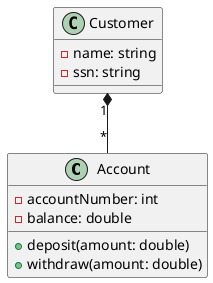
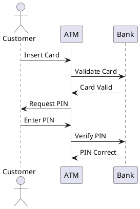
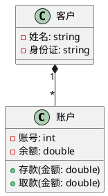

# Analysis and Design Diagrams - Comprehensive Technical Documentation
# 分析设计图示 - 完整技术文档

---

## Table of Contents | 目录

1. [Introduction](#1-introduction)
2. [Data Flow Diagrams (DFD)](#2-data-flow-diagrams-dfd)
3. [Entity-Relationship Diagrams (ERD)](#3-entity-relationship-diagrams-erd)
4. [Unified Modeling Language (UML)](#4-unified-modeling-language-uml)
5. [Flowcharts](#5-flowcharts)
6. [Nassi-Shneiderman (NS) Diagrams](#6-nassi-shneiderman-ns-diagrams)
7. [Problem Analysis Diagram (PAD)](#7-problem-analysis-diagram-pad)
8. [Diagram Comparison](#8-diagram-comparison)
9. [Tools and Software](#9-tools-and-software)
10. [Best Practices](#10-best-practices)
11. [Common Mistakes](#11-common-mistakes)
12. [Examination Guide](#12-examination-guide)

---

## 1. Introduction

### 1.1 Purpose of Analysis and Design Diagrams

**English:**
Analysis and design diagrams are visual modeling tools used to represent different aspects of software systems. They serve multiple critical purposes:

- **Communication**: Bridge between stakeholders, analysts, designers, and developers
- **Documentation**: Permanent record of system design decisions
- **Analysis**: Understand existing systems or problem domains
- **Design**: Plan system structure and behavior before implementation
- **Validation**: Verify requirements completeness and consistency
- **Maintenance**: Support system evolution and updates

Different diagrams focus on different perspectives:
- **Process perspective**: DFD, Flowcharts
- **Data perspective**: ERD
- **Object-oriented perspective**: UML
- **Logic perspective**: NS diagrams, PAD

**中文:**
分析设计图示是用于表示软件系统不同方面的可视化建模工具。它们具有多个关键目的：

- **沟通**：利益相关者、分析师、设计师和开发人员之间的桥梁
- **文档**：系统设计决策的永久记录
- **分析**：理解现有系统或问题域
- **设计**：在实现前规划系统结构和行为
- **验证**：验证需求的完整性和一致性
- **维护**：支持系统演进和更新

不同图示关注不同视角：
- **过程视角**：DFD、流程图
- **数据视角**：ERD
- **面向对象视角**：UML
- **逻辑视角**：NS图、PAD

### 1.2 Historical Evolution

**English:**

| Era        | Methodology             | Key Diagrams                   | Focus                          |
| ---------- | ----------------------- | ------------------------------ | ------------------------------ |
| **1970s**  | Structured Analysis     | DFD, ERD, Flowcharts           | Process & Data decomposition   |
| **1980s**  | Information Engineering | ERD, State Diagrams            | Data-driven design             |
| **1990s**  | Object-Oriented         | UML, CRC Cards                 | Objects, classes, interactions |
| **2000s**  | Agile/Iterative         | Simplified UML, User Stories   | Lightweight modeling           |
| **2010s+** | DevOps/Continuous       | C4, PlantUML, Diagrams-as-Code | Version-controlled, automated  |

**中文:**

| 时代          | 方法论      | 关键图示                 | 焦点             |
| ------------- | ----------- | ------------------------ | ---------------- |
| **1970年代**  | 结构化分析  | DFD、ERD、流程图         | 过程与数据分解   |
| **1980年代**  | 信息工程    | ERD、状态图              | 数据驱动设计     |
| **1990年代**  | 面向对象    | UML、CRC卡片             | 对象、类、交互   |
| **2000年代**  | 敏捷/迭代   | 简化UML、用户故事        | 轻量级建模       |
| **2010年代+** | DevOps/持续 | C4、PlantUML、代码化图示 | 版本控制、自动化 |

---

## 2. Data Flow Diagrams (DFD)

### 2.1 Definition and Purpose

**English:**
A Data Flow Diagram (DFD) is a graphical representation of data flow through a system, showing:
- **Processes**: Transform input data to output data
- **Data Stores**: Repositories where data is held
- **External Entities**: Sources or destinations of data outside the system boundary
- **Data Flows**: Movement of data between components

DFDs focus on **what** the system does, not **how** it does it. They are implementation-independent.

**中文:**
数据流图（DFD）是数据在系统中流动的图形表示，显示：
- **过程**：将输入数据转换为输出数据
- **数据存储**：保存数据的仓库
- **外部实体**：系统边界外的数据源或目的地
- **数据流**：组件之间的数据移动

DFD关注系统**做什么**，而非**如何做**。它们与实现无关。

### 2.2 Notation Elements

**English:**

**Yourdon Notation** (Circles/Bubbles):
```
┌─────────────────────────────────────────────┐
│ Process:         ⃝                          │
│                 / \                         │
│                /   \                        │
│               / Name \                      │
│               ─────────                     │
│                                             │
│ External Entity:  ┌────────┐               │
│                   │  Name  │               │
│                   └────────┘               │
│                                             │
│ Data Store:    ══ Name ══                  │
│                                             │
│ Data Flow:     ──────────>                 │
│                  Name                       │
└─────────────────────────────────────────────┘
```

**Gane-Sarson Notation** (Rounded rectangles):
```
┌─────────────────────────────────────────────┐
│ Process:         ┌──────────┐               │
│                  │   Name   │               │
│                  └──────────┘               │
│                                             │
│ External Entity:  ▭ Name ▭                 │
│                                             │
│ Data Store:      ▬▬ Name ▬▬                │
│                                             │
│ Data Flow:       ──────────>               │
│                    Name                     │
└─────────────────────────────────────────────┘
```

**中文:**

**Yourdon记号**（圆圈/气泡）：
```
┌─────────────────────────────────────────────┐
│ 过程：           ⃝                          │
│                 / \                         │
│                /   \                        │
│               / 名称 \                      │
│               ─────────                     │
│                                             │
│ 外部实体：      ┌────────┐                 │
│                │  名称  │                   │
│                └────────┘                   │
│                                             │
│ 数据存储：     ══ 名称 ══                  │
│                                             │
│ 数据流：       ──────────>                 │
│                  名称                       │
└─────────────────────────────────────────────┘
```

**Gane-Sarson记号**（圆角矩形）：
```
┌─────────────────────────────────────────────┐
│ 过程：          ┌──────────┐                │
│                 │   名称   │                │
│                 └──────────┘                │
│                                             │
│ 外部实体：       ▭ 名称 ▭                  │
│                                             │
│ 数据存储：      ▬▬ 名称 ▬▬                 │
│                                             │
│ 数据流：        ──────────>                │
│                   名称                      │
└─────────────────────────────────────────────┘
```

### 2.3 DFD Levels

**English:**

**Context Diagram (Level -1 or 0)**:
- Shows the entire system as a single process
- External entities interacting with the system
- Major data flows in/out of system boundary

**Level 0 DFD**:
- Expands the context diagram
- Shows major processes (usually 5-7)
- Major data stores
- Data flows between processes

**Level 1, 2, 3... DFDs**:
- Decompose Level 0 processes into sub-processes
- Each level adds more detail
- Stop when processes are primitive (cannot be further decomposed meaningfully)

**Balancing Rule**: 
- Data flows entering/leaving a process must match at all levels
- Number and names of data flows into parent = sum of flows into children

**中文:**

**上下文图（层次-1或0）**：
- 将整个系统显示为单个过程
- 与系统交互的外部实体
- 系统边界内外的主要数据流

**0层DFD**：
- 展开上下文图
- 显示主要过程（通常5-7个）
- 主要数据存储
- 过程之间的数据流

**1、2、3...层DFD**：
- 将0层过程分解为子过程
- 每层增加更多细节
- 当过程为原语（无法有意义地进一步分解）时停止

**平衡规则**：
- 进入/离开过程的数据流必须在所有层次匹配
- 进入父过程的数据流数量和名称 = 进入子过程的流之和

### 2.4 Example: Library Management System

**English:**

**Context Diagram**:
```
                    Book Request
         Reader ──────────────────> ┌──────────────┐
                                    │              │
         Borrowed Book              │   Library    │  Book Order
                <────────────────── │  Management  │ ──────────> Supplier
                                    │    System    │
         Return Notice              │              │  Book Delivery
                <────────────────── └──────────────┘ <──────────
                                           │
                                           │ Catalog Query
                                           v
                                    Librarian
```

**Level 0 DFD**:
```
┌────────┐                         ┌──────────────┐
│ Reader │ Book Request            │   Process    │
│        │ ───────────────────────>│   Borrow     │
└────────┘                         │   Request    │
                                   └──────┬───────┘
                                          │
                                          v
                                   ┌──────────────┐
                                   │   D1: Books  │
                                   └──────────────┘
```

**中文:**

**上下文图**：
```
                    图书请求
         读者 ──────────────────> ┌──────────────┐
                                  │              │
         借阅图书                  │   图书管理   │  图书订单
                <────────────────│    系统      │ ──────────> 供应商
                                  │              │
         归还通知                  │              │  图书交付
                <────────────────└──────────────┘ <──────────
                                         │
                                         │ 目录查询
                                         v
                                    图书管理员
```

**0层DFD**：
```
┌────────┐                         ┌──────────────┐
│  读者  │ 图书请求                │   处理借阅   │
│        │ ───────────────────────>│     请求     │
└────────┘                         └──────┬───────┘
                                          │
                                          v
                                   ┌──────────────┐
                                   │  D1: 图书    │
                                   └──────────────┘
```

### 2.5 DFD Rules and Best Practices

**English:**

**Rules**:
1. **No loops**: Data cannot flow directly back to its source without processing
2. **Process naming**: Use verb-object format (e.g., "Validate Order")
3. **Data flow naming**: Use noun phrases (e.g., "Customer Details")
4. **Black holes**: Every process must have output
5. **Miracles**: Every process must have input
6. **Data stores**: Cannot directly connect to external entities

**Best Practices**:
- Keep diagrams simple (5-9 processes per level)
- Use meaningful, business-oriented names
- Number processes for traceability (1.0, 1.1, 1.2...)
- Maintain consistent naming across levels
- Document assumptions and constraints

**中文:**

**规则**：
1. **无循环**：数据不能在未经处理的情况下直接流回源
2. **过程命名**：使用动词-宾语格式（如"验证订单"）
3. **数据流命名**：使用名词短语（如"客户详情"）
4. **黑洞**：每个过程必须有输出
5. **奇迹**：每个过程必须有输入
6. **数据存储**：不能直接连接到外部实体

**最佳实践**：
- 保持图示简单（每层5-9个过程）
- 使用有意义的、面向业务的名称
- 为过程编号以便追踪（1.0、1.1、1.2...）
- 保持各层命名一致
- 记录假设和约束

---

## 3. Entity-Relationship Diagrams (ERD)

### 3.1 Definition and Purpose

**English:**
An Entity-Relationship Diagram (ERD) models the data structure of a system by showing:
- **Entities**: Objects or concepts about which data is stored
- **Attributes**: Properties of entities
- **Relationships**: Associations between entities
- **Cardinality**: Number of instances involved in relationships

ERDs are used for:
- Database design
- Understanding data requirements
- Communicating data structure to stakeholders
- Normalization and optimization

**中文:**
实体关系图（ERD）通过显示以下内容来建模系统的数据结构：
- **实体**：存储数据的对象或概念
- **属性**：实体的属性
- **关系**：实体之间的关联
- **基数**：关系中涉及的实例数量

ERD用于：
- 数据库设计
- 理解数据需求
- 向利益相关者传达数据结构
- 规范化和优化

### 3.2 Notation Styles

**English:**

**Chen Notation** (Original, 1976):
```
┌─────────────────────────────────────────┐
│ Entity:       ┌─────────┐               │
│               │  Name   │               │
│               └─────────┘               │
│                                         │
│ Attribute:         (Name)               │
│                                         │
│ Relationship:     ◇ Name ◇             │
│                                         │
│ Cardinality:  1 ──────── M              │
│               1 ──────── N              │
└─────────────────────────────────────────┘
```

**Crow's Foot Notation** (Most popular):
```
┌─────────────────────────────────────────┐
│ Entity:       ┌─────────┐               │
│               │  Name   │               │
│               ├─────────┤               │
│               │ attr1   │               │
│               │ attr2   │               │
│               └─────────┘               │
│                                         │
│ One-to-One:    ─────|──|─────          │
│ One-to-Many:   ─────|──<─────          │
│ Many-to-Many:  ─────>──<─────          │
│                                         │
│ Optionality:   ─────o (optional)       │
│                ─────| (mandatory)       │
└─────────────────────────────────────────┘
```

**IE Notation** (Information Engineering):
```
Similar to Crow's Foot but with different symbols
```

**中文:**

**Chen记号**（原始，1976）：
```
┌─────────────────────────────────────────┐
│ 实体：        ┌─────────┐               │
│              │   名称   │               │
│              └─────────┘                │
│                                         │
│ 属性：            (名称)                │
│                                         │
│ 关系：          ◇ 名称 ◇               │
│                                         │
│ 基数：       1 ──────── M               │
│              1 ──────── N               │
└─────────────────────────────────────────┘
```

**鸦脚记号**（最流行）：
```
┌─────────────────────────────────────────┐
│ 实体：        ┌─────────┐               │
│              │   名称   │               │
│              ├─────────┤                │
│              │ 属性1   │                │
│              │ 属性2   │                │
│              └─────────┘                │
│                                         │
│ 一对一：       ─────|──|─────           │
│ 一对多：       ─────|──<─────           │
│ 多对多：       ─────>──<─────           │
│                                         │
│ 可选性：       ─────o (可选)            │
│                ─────| (强制)            │
└─────────────────────────────────────────┘
```

**IE记号**（信息工程）：
```
类似鸦脚记号但使用不同符号
```

### 3.3 Cardinality and Participation

**English:**

**Cardinality Types**:
- **One-to-One (1:1)**: Each entity instance relates to at most one instance
  - Example: Person ─ Passport
- **One-to-Many (1:N)**: One entity instance relates to many instances
  - Example: Department ─< Employee
- **Many-to-Many (M:N)**: Many instances relate to many instances
  - Example: Student >─< Course

**Participation Constraints**:
- **Total (Mandatory)**: Every entity instance must participate
  - Notation: Double line or filled symbol
- **Partial (Optional)**: Entity instance may or may not participate
  - Notation: Single line or hollow symbol

**中文:**

**基数类型**：
- **一对一（1:1）**：每个实体实例最多关联一个实例
  - 示例：人 ─ 护照
- **一对多（1:N）**：一个实体实例关联多个实例
  - 示例：部门 ─< 员工
- **多对多（M:N）**：多个实例关联多个实例
  - 示例：学生 >─< 课程

**参与约束**：
- **全部（强制）**：每个实体实例必须参与
  - 记号：双线或填充符号
- **部分（可选）**：实体实例可能参与也可能不参与
  - 记号：单线或空心符号

### 3.4 Example: University Database

**English:**

**Chen Notation**:
```
         1                M
┌─────────┐    enrolls    ┌─────────┐
│ Student │◇──────────────◇│ Course  │
└─────────┘                └─────────┘
   │                           │
   │                           │
(StudentID)                (CourseID)
  (Name)                     (Title)
  (Major)                   (Credits)
```

**Crow's Foot Notation**:
```
┌──────────────┐                  ┌──────────────┐
│   Student    │                  │   Course     │
├──────────────┤                  ├──────────────┤
│ PK StudentID │──────────────────│ PK CourseID  │
│    Name      │ |              < │    Title     │
│    Major     │                  │    Credits   │
│    Email     │                  │    Dept      │
└──────────────┘                  └──────────────┘
      |                                  |
      | enrolls in                  offered by
      |                                  |
      v                                  v
┌──────────────┐                  ┌──────────────┐
│ Enrollment   │                  │  Department  │
├──────────────┤                  ├──────────────┤
│ FK StudentID │                  │ PK DeptID    │
│ FK CourseID  │                  │    DeptName  │
│    Grade     │                  │    Building  │
│    Semester  │                  └──────────────┘
└──────────────┘
```

**中文:**

**Chen记号**：
```
         1                M
┌─────────┐    注册      ┌─────────┐
│  学生   │◇──────────────◇│  课程   │
└─────────┘                └─────────┘
   │                           │
   │                           │
(学号)                      (课程号)
 (姓名)                       (标题)
 (专业)                       (学分)
```

**鸦脚记号**：
```
┌──────────────┐                  ┌──────────────┐
│     学生     │                  │     课程     │
├──────────────┤                  ├──────────────┤
│ PK 学号      │──────────────────│ PK 课程号    │
│    姓名      │ |              < │    标题      │
│    专业      │                  │    学分      │
│    邮箱      │                  │    系别      │
└──────────────┘                  └──────────────┘
      |                                  |
      | 注册                        开设于
      |                                  |
      v                                  v
┌──────────────┐                  ┌──────────────┐
│   注册记录   │                  │     院系     │
├──────────────┤                  ├──────────────┤
│ FK 学号      │                  │ PK 系号      │
│ FK 课程号    │                  │    系名      │
│    成绩      │                  │    楼号      │
│    学期      │                  └──────────────┘
└──────────────┘
```

### 3.5 ERD to Relational Schema

**English:**

**Mapping Rules**:

1. **Entity → Table**
   - Entity becomes a table
   - Attributes become columns
   - Primary key identified

2. **1:1 Relationship**
   - Add foreign key to either table
   - Prefer table with total participation

3. **1:N Relationship**
   - Add foreign key to "many" side table

4. **M:N Relationship**
   - Create junction/bridge table
   - Foreign keys from both entities
   - Composite primary key

**Example**:
```sql
-- From University ERD above

CREATE TABLE Student (
    StudentID INT PRIMARY KEY,
    Name VARCHAR(100),
    Major VARCHAR(50),
    Email VARCHAR(100)
);

CREATE TABLE Course (
    CourseID VARCHAR(10) PRIMARY KEY,
    Title VARCHAR(100),
    Credits INT,
    DeptID INT,
    FOREIGN KEY (DeptID) REFERENCES Department(DeptID)
);

CREATE TABLE Enrollment (
    StudentID INT,
    CourseID VARCHAR(10),
    Grade CHAR(2),
    Semester VARCHAR(20),
    PRIMARY KEY (StudentID, CourseID),
    FOREIGN KEY (StudentID) REFERENCES Student(StudentID),
    FOREIGN KEY (CourseID) REFERENCES Course(CourseID)
);
```

**中文:**

**映射规则**：

1. **实体 → 表**
   - 实体变成表
   - 属性变成列
   - 识别主键

2. **1:1关系**
   - 向任一表添加外键
   - 优先选择全参与的表

3. **1:N关系**
   - 向"多"端表添加外键

4. **M:N关系**
   - 创建连接/桥接表
   - 来自两个实体的外键
   - 复合主键

**示例**：
```sql
-- 来自上述大学ERD

CREATE TABLE Student (
    StudentID INT PRIMARY KEY,
    Name VARCHAR(100),
    Major VARCHAR(50),
    Email VARCHAR(100)
);

CREATE TABLE Course (
    CourseID VARCHAR(10) PRIMARY KEY,
    Title VARCHAR(100),
    Credits INT,
    DeptID INT,
    FOREIGN KEY (DeptID) REFERENCES Department(DeptID)
);

CREATE TABLE Enrollment (
    StudentID INT,
    CourseID VARCHAR(10),
    Grade CHAR(2),
    Semester VARCHAR(20),
    PRIMARY KEY (StudentID, CourseID),
    FOREIGN KEY (StudentID) REFERENCES Student(StudentID),
    FOREIGN KEY (CourseID) REFERENCES Course(CourseID)
);
```

---

## 4. Unified Modeling Language (UML)

### 4.1 UML Overview

**English:**
UML (Unified Modeling Language) is a standardized modeling language for object-oriented software. UML 2.x defines **14 diagram types** in two categories:

**Structural Diagrams** (Static structure):
1. Class Diagram
2. Object Diagram
3. Component Diagram
4. Deployment Diagram
5. Package Diagram
6. Composite Structure Diagram
7. Profile Diagram (UML extension mechanism)

**Behavioral Diagrams** (Dynamic behavior):
8. Use Case Diagram
9. Activity Diagram
10. State Machine Diagram
11. Sequence Diagram
12. Communication Diagram
13. Timing Diagram
14. Interaction Overview Diagram

**中文:**
UML（统一建模语言）是面向对象软件的标准化建模语言。UML 2.x定义了两类**14种图类型**：

**结构图**（静态结构）：
1. 类图
2. 对象图
3. 组件图
4. 部署图
5. 包图
6. 复合结构图
7. 配置文件图（UML扩展机制）

**行为图**（动态行为）：
8. 用例图
9. 活动图
10. 状态机图
11. 序列图
12. 通信图
13. 时序图
14. 交互概览图

### 4.2 Class Diagram

**English:**
The most important UML diagram, showing classes, attributes, methods, and relationships.

**Notation**:
```
┌─────────────────────────┐
│      ClassName          │ ← Class name
├─────────────────────────┤
│ - privateAttr: Type     │ ← Attributes
│ + publicAttr: Type      │   (- private, + public, # protected)
│ # protectedAttr: Type   │
├─────────────────────────┤
│ + publicMethod(): Type  │ ← Methods
│ - privateMethod(): Type │
└─────────────────────────┘
```

**Relationships**:
```
Association:       ClassA ────────── ClassB
Directed Assoc:    ClassA ──────────> ClassB
Aggregation:       ClassA ◇────────── ClassB  (has-a, weak)
Composition:       ClassA ◆────────── ClassB  (owns, strong)
Inheritance:       SubClass ─────────▷ SuperClass
Realization:       Class ─ ─ ─ ─ ─ ─▷ Interface
Dependency:        ClassA ─ ─ ─ ─ ─ > ClassB
```

**Multiplicity**:
```
1       exactly one
0..1    zero or one
*       zero or more
1..*    one or more
n       exactly n
m..n    between m and n
```

**Example: Banking System**:
```
┌─────────────────────┐
│      Account        │
├─────────────────────┤
│ - accountNumber: int│
│ - balance: double   │
├─────────────────────┤
│ + deposit(amt)      │
│ + withdraw(amt)     │
└──────────▲──────────┘
           │
           │ (inheritance)
           │
    ┌──────┴──────┐
    │             │
┌───────────┐ ┌──────────────┐
│ Checking  │ │   Savings    │
│  Account  │ │   Account    │
├───────────┤ ├──────────────┤
│-overdraft │ │-interestRate │
├───────────┤ ├──────────────┤
│+calcFee() │ │+calcInterest()│
└───────────┘ └──────────────┘

┌─────────────┐   1       *  ┌─────────────┐
│   Customer  │◆────────────│   Account   │
├─────────────┤ owns        ├─────────────┤
│ - name      │              │ - number    │
│ - ssn       │              │ - balance   │
└─────────────┘              └─────────────┘
```

**中文:**
最重要的UML图，显示类、属性、方法和关系。

**记号**：
```
┌─────────────────────────┐
│       类名              │ ← 类名
├─────────────────────────┤
│ - privateAttr: Type     │ ← 属性
│ + publicAttr: Type      │   (- 私有, + 公有, # 保护)
│ # protectedAttr: Type   │
├─────────────────────────┤
│ + publicMethod(): Type  │ ← 方法
│ - privateMethod(): Type │
└─────────────────────────┘
```

**关系**：
```
关联：           类A ────────── 类B
定向关联：       类A ──────────> 类B
聚合：           类A ◇────────── 类B  (有，弱)
组合：           类A ◆────────── 类B  (拥有，强)
继承：           子类 ─────────▷ 父类
实现：           类 ─ ─ ─ ─ ─ ─▷ 接口
依赖：           类A ─ ─ ─ ─ ─ > 类B
```

**多重性**：
```
1       恰好一个
0..1    零或一个
*       零或多个
1..*    一或多个
n       恰好n个
m..n    m到n之间
```

### 4.3 Use Case Diagram

**English:**
Shows system functionality from user perspective.

**Elements**:
```
Actor:         ⚉ (stick figure)
Use Case:      ( Ellipse )
System:        ┌────────┐ (rectangle boundary)
Association:   ───────── (line)
Include:       ─ ─ ─ ─ > «include»
Extend:        ─ ─ ─ ─ > «extend»
Generalization: ─────────▷
```

**Example: ATM System**:
```
                           ATM System
    ┌────────────────────────────────────────┐
    │                                        │
    │  ( Withdraw Cash )                     │
    │         │                              │
⚉   │         │ «include»                   │
Customer      │ ┌ ─ ─ ─ ─ ─ >               │
    │         │              ( Authenticate )│
    │  ( Check Balance )            │        │
    │         │                     │        │
    │         │ «include»          │        │
    │         └ ─ ─ ─ ─ ─ ─ ─ ─ ─ ┘        │
    │                                        │
    │  ( Transfer Funds )                    │
    └────────────────────────────────────────┘
              │
              │ «extend»
              v
       ( Generate Receipt )
```

**中文:**
从用户角度显示系统功能。

**元素**：
```
参与者：       ⚉ (简笔人形)
用例：         ( 椭圆 )
系统：         ┌────────┐ (矩形边界)
关联：         ───────── (线)
包含：         ─ ─ ─ ─ > «include»
扩展：         ─ ─ ─ ─ > «extend»
泛化：         ─────────▷
```

### 4.4 Sequence Diagram

**English:**
Shows object interactions over time.

**Notation**:
```
Object:    ┌────────┐
           │ Object │
           └───┬────┘
               │  ← Lifeline
               │
Message:   ────────>  (synchronous)
           ─ ─ ─ ─ >  (asynchronous)
Return:    <─ ─ ─ ─   (dashed)
Activation: ▐ (rectangle on lifeline)
```

**Example: Online Purchase**:
```
Customer    WebUI      Order       Payment     Inventory
   │           │          │            │            │
   │ browse()  │          │            │            │
   │─────────>│          │            │            │
   │           │          │            │            │
   │addToCart()│          │            │            │
   │─────────>│          │            │            │
   │           │          │            │            │
   │checkout() │          │            │            │
   │─────────>│          │            │            │
   │           │createOrder()         │            │
   │           │─────────>│           │            │
   │           │          │ processPayment()       │
   │           │          │──────────>│            │
   │           │          │           │checkStock()│
   │           │          │           │──────────>│
   │           │          │           │<─ ─ ─ ─ ─ │
   │           │          │<─ ─ ─ ─ ─│   available│
   │           │<─ ─ ─ ─ ─│           │            │
   │<─ ─ ─ ─ ─│   confirmation        │            │
```

**中文:**
显示对象随时间的交互。

**记号**：
```
对象：     ┌────────┐
          │  对象  │
          └───┬────┘
              │  ← 生命线
              │
消息：     ────────>  (同步)
          ─ ─ ─ ─ >  (异步)
返回：     <─ ─ ─ ─   (虚线)
激活：     ▐ (生命线上的矩形)
```

### 4.5 State Machine Diagram

**English:**
Models object lifecycle and state transitions.

**Elements**:
```
Initial State:   ⚫ (filled circle)
Final State:     ◉ (bull's eye)
State:           ┌────────────┐
                 │ State Name │
                 └────────────┘
Transition:      ──────────────>
                 event [guard] / action
```

**Example: Order State**:
```
    ⚫
    │
    │ create order
    v
┌─────────┐  cancel     ┌──────────┐
│ Pending │─────────────>│ Cancelled│
└────┬────┘              └──────────┘
     │
     │ confirm
     v
┌─────────┐  payment fails  ┌──────────┐
│Confirmed│─────────────────>│ Failed   │
└────┬────┘                  └──────────┘
     │
     │ payment success
     v
┌─────────┐  ship       ┌──────────┐
│  Paid   │────────────>│ Shipped  │
└─────────┘             └────┬─────┘
                             │
                             │ deliver
                             v
                        ┌──────────┐
                        │Delivered │
                        └────┬─────┘
                             │
                             │ complete
                             v
                             ◉
```

**中文:**
建模对象生命周期和状态转换。

**元素**：
```
初始状态：   ⚫ (实心圆)
最终状态：   ◉ (靶心)
状态：       ┌────────────┐
            │   状态名   │
            └────────────┘
转换：       ──────────────>
            事件 [守卫] / 动作
```

### 4.6 Activity Diagram

**English:**
Models workflow and business processes (similar to flowcharts but object-oriented).

**Elements**:
```
Start:        ⚫
End:          ◉
Activity:     ┌──────────┐
              │ Activity │
              └──────────┘
Decision:       ◇
Fork/Join:    ━━━━━━━━ (thick bar)
Swimlane:     │Column│ (partition by actor/role)
```

**Example: Order Fulfillment**:
```
      ⚫
      │
      v
┌─────────────┐
│Receive Order│
└──────┬──────┘
       │
       v
      ◇ Stock?
     /   \
   Yes    No
   │       │
   v       v
┌────┐  ┌──────────┐
│Ship│  │Backorder │
└──┬─┘  └────┬─────┘
   │         │
   │         v
   │    ┌─────────┐
   │    │ Restock │
   │    └────┬────┘
   │         │
   └────┬────┘
        v
   ┌─────────┐
   │ Invoice │
   └────┬────┘
        v
        ◉
```

**中文:**
建模工作流和业务过程（类似流程图但面向对象）。

**元素**：
```
开始：        ⚫
结束：        ◉
活动：        ┌──────────┐
             │   活动   │
             └──────────┘
决策：          ◇
分叉/合并：   ━━━━━━━━ (粗条)
泳道：        │列│ (按参与者/角色分区)
```

---

## 5. Flowcharts

### 5.1 Definition and Purpose

**English:**
Flowcharts are graphical representations of algorithms or processes using standardized symbols (ISO 5807). They show:
- Sequence of operations
- Decision points
- Data flow
- Control flow

Widely used for:
- Algorithm design
- Process documentation
- Problem-solving
- Communication with non-technical stakeholders

**中文:**
流程图是使用标准化符号（ISO 5807）的算法或过程的图形表示。它们显示：
- 操作序列
- 决策点
- 数据流
- 控制流

广泛用于：
- 算法设计
- 过程文档
- 问题解决
- 与非技术利益相关者沟通

### 5.2 Standard Symbols (ISO 5807)

**English:**
```
┌──────────────────────────────────────────┐
│ Terminal (Start/End):                    │
│      ┌─────────┐                         │
│      │  Start  │                         │
│      └─────────┘                         │
│                                          │
│ Process:                                 │
│      ┌──────────────┐                    │
│      │   Process    │                    │
│      └──────────────┘                    │
│                                          │
│ Decision:                                │
│          ◇                               │
│         / \                              │
│        /   \                             │
│       / Yes? \                           │
│       ─────────                          │
│                                          │
│ Input/Output:                            │
│      ┌────────────┐                      │
│     /  Input/Out  \                      │
│    └────────────────┘                    │
│                                          │
│ Predefined Process (Subroutine):        │
│      ├──────────────┤                    │
│      │  Subroutine  │                    │
│      ├──────────────┤                    │
│                                          │
│ Document:                                │
│      ┌──────────────┐                    │
│      │   Document   │                    │
│      └──────┬───────┘                    │
│             └─────                       │
│                                          │
│ Data Storage:                            │
│       ┌◀────────┐                        │
│       │ Storage │                        │
│       └─────────┘                        │
│                                          │
│ Connector:                               │
│          ⚪ (same page)                  │
│          ⬢ (different page)              │
│                                          │
│ Flow Line:                               │
│      ───────────>                        │
└──────────────────────────────────────────┘
```

**中文:**
```
┌──────────────────────────────────────────┐
│ 终端（开始/结束）：                      │
│      ┌─────────┐                         │
│      │  开始   │                         │
│      └─────────┘                         │
│                                          │
│ 过程：                                   │
│      ┌──────────────┐                    │
│      │     过程     │                    │
│      └──────────────┘                    │
│                                          │
│ 决策：                                   │
│          ◇                               │
│         / \                              │
│        /   \                             │
│       /  是? \                           │
│       ─────────                          │
│                                          │
│ 输入/输出：                              │
│      ┌────────────┐                      │
│     /   输入/输出  \                     │
│    └────────────────┘                    │
│                                          │
│ 预定义过程（子程序）：                   │
│      ├──────────────┤                    │
│      │    子程序    │                    │
│      ├──────────────┤                    │
│                                          │
│ 文档：                                   │
│      ┌──────────────┐                    │
│      │     文档     │                    │
│      └──────┬───────┘                    │
│             └─────                       │
│                                          │
│ 数据存储：                               │
│       ┌◀────────┐                        │
│       │  存储   │                        │
│       └─────────┘                        │
│                                          │
│ 连接器：                                 │
│          ⚪ (同页)                       │
│          ⬢ (不同页)                     │
│                                          │
│ 流线：                                   │
│      ───────────>                        │
└──────────────────────────────────────────┘
```

### 5.3 Example: Login Algorithm

**English:**
```
        ┌─────────┐
        │  Start  │
        └────┬────┘
             │
             v
      ┌────────────┐
     /  Input User  \
    /   & Password   \
    └────────┬────────┘
             │
             v
        ◇ Valid?
       /         \
     No           Yes
      │            │
      v            v
┌──────────┐  ┌──────────┐
│ Display  │  │ Display  │
│  Error   │  │ Welcome  │
└────┬─────┘  └────┬─────┘
     │             │
     │             v
     │        ◇ Admin?
     │       /         \
     │     No           Yes
     │      │            │
     │      v            v
     │ ┌────────┐  ┌──────────┐
     │ │ User   │  │  Admin   │
     │ │ Portal │  │  Portal  │
     │ └───┬────┘  └────┬─────┘
     │     │            │
     └──┬──┘            │
        └───────┬───────┘
                v
           ┌─────────┐
           │   End   │
           └─────────┘
```

**中文:**
```
        ┌─────────┐
        │  开始   │
        └────┬────┘
             │
             v
      ┌────────────┐
     /  输入用户名  \
    /    和密码      \
    └────────┬────────┘
             │
             v
        ◇ 有效？
       /         \
      否          是
      │            │
      v            v
┌──────────┐  ┌──────────┐
│  显示    │  │  显示    │
│  错误    │  │  欢迎    │
└────┬─────┘  └────┬─────┘
     │             │
     │             v
     │        ◇ 管理员？
     │       /         \
     │      否          是
     │      │            │
     │      v            v
     │ ┌────────┐  ┌──────────┐
     │ │ 用户   │  │  管理员  │
     │ │ 门户   │  │  门户    │
     │ └───┬────┘  └────┬─────┘
     │     │            │
     └──┬──┘            │
        └───────┬───────┘
                v
           ┌─────────┐
           │  结束   │
           └─────────┘
```

### 5.4 Best Practices

**English:**
1. **Top-to-bottom, left-to-right flow**: Natural reading order
2. **Avoid crossing lines**: Keep diagram clean
3. **One entry, one exit**: Structured programming principle
4. **Consistent naming**: Use verb-noun for processes
5. **Keep it simple**: One process per box
6. **Use connectors**: For complex flows
7. **Document assumptions**: Annotate edge cases

**中文:**
1. **从上到下、从左到右流动**：自然阅读顺序
2. **避免线条交叉**：保持图示整洁
3. **一个入口、一个出口**：结构化编程原则
4. **一致命名**：过程使用动词-名词
5. **保持简单**：每个框一个过程
6. **使用连接器**：用于复杂流程
7. **记录假设**：注释边缘情况

---

## 6. Nassi-Shneiderman (NS) Diagrams

### 6.1 Definition and Purpose

**English:**
Nassi-Shneiderman (NS) diagrams, also called **Chapin charts** or **structured flowcharts**, were developed in 1972 to enforce structured programming without GOTO statements.

**Key Features**:
- Box-based representation
- No arrows (flow is implicit top-to-bottom)
- Three control structures only: Sequence, Selection, Iteration
- Forces structured thinking

**Advantages over Flowcharts**:
- Cannot represent GOTO (eliminates spaghetti code)
- More compact
- Easier to maintain
- Clearer scope of control structures

**中文:**
Nassi-Shneiderman（NS）图，也称为**Chapin图**或**结构化流程图**，于1972年开发，用于在没有GOTO语句的情况下强制执行结构化编程。

**关键特性**：
- 基于框的表示
- 无箭头（流动是隐式从上到下）
- 仅三种控制结构：顺序、选择、迭代
- 强制结构化思维

**相比流程图的优势**：
- 无法表示GOTO（消除意大利面代码）
- 更紧凑
- 更易于维护
- 更清晰的控制结构范围

### 6.2 Basic Constructs

**English:**

**1. Sequence**:
```
┌──────────────────────┐
│   Statement 1        │
├──────────────────────┤
│   Statement 2        │
├──────────────────────┤
│   Statement 3        │
└──────────────────────┘
```

**2. Selection (If-Then-Else)**:
```
┌──────────────────────┐
│    Condition         │
├──────────┬───────────┤
│   True   │   False   │
│          │           │
│ Action A │ Action B  │
│          │           │
└──────────┴───────────┘
```

**3. Iteration (While Loop)**:
```
┌──────────────────────┐
│ While Condition      │
│ ┌──────────────────┐ │
│ │  Loop Body       │ │
│ │                  │ │
│ └──────────────────┘ │
└──────────────────────┘
```

**4. Iteration (For Loop)**:
```
┌──────────────────────┐
│ For i = 1 to N       │
│ ┌──────────────────┐ │
│ │  Loop Body       │ │
│ └──────────────────┘ │
└──────────────────────┘
```

**5. Case (Switch)**:
```
┌────────────────────────────────────┐
│         Variable                   │
├──────┬──────┬──────┬──────┬───────┤
│Case 1│Case 2│Case 3│Case 4│Default│
│      │      │      │      │       │
│Action│Action│Action│Action│Action │
│  A   │  B   │  C   │  D   │  E    │
└──────┴──────┴──────┴──────┴───────┘
```

**中文:**

**1. 顺序**：
```
┌──────────────────────┐
│   语句1              │
├──────────────────────┤
│   语句2              │
├──────────────────────┤
│   语句3              │
└──────────────────────┘
```

**2. 选择（If-Then-Else）**：
```
┌──────────────────────┐
│    条件              │
├──────────┬───────────┤
│    真    │    假     │
│          │           │
│  动作A   │  动作B    │
│          │           │
└──────────┴───────────┘
```

**3. 迭代（While循环）**：
```
┌──────────────────────┐
│ While 条件           │
│ ┌──────────────────┐ │
│ │  循环体          │ │
│ │                  │ │
│ └──────────────────┘ │
└──────────────────────┘
```

**4. 迭代（For循环）**：
```
┌──────────────────────┐
│ For i = 1 to N       │
│ ┌──────────────────┐ │
│ │  循环体          │ │
│ └──────────────────┘ │
└──────────────────────┘
```

**5. 情况（Switch）**：
```
┌────────────────────────────────────┐
│         变量                       │
├──────┬──────┬──────┬──────┬───────┤
│情况1 │情况2 │情况3 │情况4 │默认   │
│      │      │      │      │       │
│动作  │动作  │动作  │动作  │动作   │
│  A   │  B   │  C   │  D   │  E    │
└──────┴──────┴──────┴──────┴───────┘
```

### 6.3 Example: Binary Search

**English:**
```
┌─────────────────────────────────────────────┐
│ Binary Search (array, key)                  │
├─────────────────────────────────────────────┤
│ low = 0                                     │
├─────────────────────────────────────────────┤
│ high = array.length - 1                     │
├─────────────────────────────────────────────┤
│ While low <= high                           │
│ ┌─────────────────────────────────────────┐ │
│ │ mid = (low + high) / 2                  │ │
│ ├─────────────────────────────────────────┤ │
│ │          array[mid] vs key              │ │
│ │ ┌───────┬───────────┬───────────────┐   │ │
│ │ │  ==   │     <     │       >       │   │ │
│ │ │       │           │               │   │ │
│ │ │Return │ low=mid+1 │  high=mid-1   │   │ │
│ │ │ mid   │           │               │   │ │
│ │ └───────┴───────────┴───────────────┘   │ │
│ └─────────────────────────────────────────┘ │
├─────────────────────────────────────────────┤
│ Return -1 (not found)                       │
└─────────────────────────────────────────────┘
```

**中文:**
```
┌─────────────────────────────────────────────┐
│ 二分查找 (数组, 键)                         │
├─────────────────────────────────────────────┤
│ low = 0                                     │
├─────────────────────────────────────────────┤
│ high = 数组.长度 - 1                        │
├─────────────────────────────────────────────┤
│ While low <= high                           │
│ ┌─────────────────────────────────────────┐ │
│ │ mid = (low + high) / 2                  │ │
│ ├─────────────────────────────────────────┤ │
│ │          数组[mid] vs 键                │ │
│ │ ┌───────┬───────────┬───────────────┐   │ │
│ │ │  ==   │     <     │       >       │   │ │
│ │ │       │           │               │   │ │
│ │ │返回   │ low=mid+1 │  high=mid-1   │   │ │
│ │ │ mid   │           │               │   │ │
│ │ └───────┴───────────┴───────────────┘   │ │
│ └─────────────────────────────────────────┘ │
├─────────────────────────────────────────────┤
│ 返回 -1 (未找到)                            │
└─────────────────────────────────────────────┘
```

---

## 7. Problem Analysis Diagram (PAD)

### 7.1 Definition and Origin

**English:**
Problem Analysis Diagram (PAD) is a structured design tool developed in Japan in the 1970s by Hitachi. It represents program logic using a tree-like hierarchical structure.

**Key Features**:
- Two-dimensional tree structure
- Vertical lines for sequence
- Horizontal divisions for selection/iteration
- No arrows needed
- Similar to NS diagrams but more flexible

**中文:**
问题分析图（PAD）是1970年代由日立在日本开发的结构化设计工具。它使用树状层次结构表示程序逻辑。

**关键特性**：
- 二维树结构
- 垂直线表示顺序
- 水平分割表示选择/迭代
- 不需要箭头
- 类似NS图但更灵活

### 7.2 Basic Constructs

**English:**

**Sequence**:
```
│
├─ Statement 1
│
├─ Statement 2
│
├─ Statement 3
│
```

**Selection (If-Then-Else)**:
```
│
├─ Condition?
│  ├─ Y ─ Action A
│  └─ N ─ Action B
│
```

**Iteration (While)**:
```
│
├─ While Condition
│  ○───┐
│      │ Loop Body
│      └───┘
│
```

**Case (Multi-way branch)**:
```
│
├─ Variable
│  ├─ Case 1 ─ Action 1
│  ├─ Case 2 ─ Action 2
│  ├─ Case 3 ─ Action 3
│  └─ Default ─ Action D
│
```

**中文:**

**顺序**：
```
│
├─ 语句1
│
├─ 语句2
│
├─ 语句3
│
```

**选择（If-Then-Else）**：
```
│
├─ 条件？
│  ├─ 是 ─ 动作A
│  └─ 否 ─ 动作B
│
```

**迭代（While）**：
```
│
├─ While 条件
│  ○───┐
│      │ 循环体
│      └───┘
│
```

**情况（多路分支）**：
```
│
├─ 变量
│  ├─ 情况1 ─ 动作1
│  ├─ 情况2 ─ 动作2
│  ├─ 情况3 ─ 动作3
│  └─ 默认 ─ 动作D
│
```

---

## 8. Diagram Comparison

### 8.1 Comparison Matrix

**English:**

| Aspect                 | DFD              | ERD               | UML        | Flowchart    | NS Diagram      | PAD             |
| ---------------------- | ---------------- | ----------------- | ---------- | ------------ | --------------- | --------------- |
| **Focus**              | Data flow        | Data structure    | OO design  | Algorithm    | Algorithm       | Algorithm       |
| **Paradigm**           | Structured       | Data modeling     | OO         | Procedural   | Structured      | Structured      |
| **Complexity**         | Medium           | Medium            | High       | Low          | Medium          | Medium          |
| **Learning Curve**     | Easy             | Easy              | Steep      | Very Easy    | Medium          | Medium          |
| **Tool Support**       | Good             | Excellent         | Excellent  | Excellent    | Limited         | Limited         |
| **Standards**          | Yourdon, G-S     | Chen, Crow's Foot | UML 2.x    | ISO 5807     | None formal     | None formal     |
| **Best For**           | Process analysis | Database design   | OO systems | Simple logic | Structured code | Structured code |
| **Arrows**             | Yes              | Yes               | Yes        | Yes          | No              | No              |
| **Enforces Structure** | No               | No                | No         | No           | Yes             | Yes             |
| **Exam Frequency**     | Very High        | Very High         | Very High  | High         | Medium          | Low             |

**中文:**

| 方面         | DFD          | ERD        | UML          | 流程图   | NS图       | PAD        |
| ------------ | ------------ | ---------- | ------------ | -------- | ---------- | ---------- |
| **焦点**     | 数据流       | 数据结构   | 面向对象设计 | 算法     | 算法       | 算法       |
| **范式**     | 结构化       | 数据建模   | 面向对象     | 过程式   | 结构化     | 结构化     |
| **复杂性**   | 中等         | 中等       | 高           | 低       | 中等       | 中等       |
| **学习曲线** | 容易         | 容易       | 陡峭         | 非常容易 | 中等       | 中等       |
| **工具支持** | 好           | 优秀       | 优秀         | 优秀     | 有限       | 有限       |
| **标准**     | Yourdon, G-S | Chen, 鸦脚 | UML 2.x      | ISO 5807 | 无正式     | 无正式     |
| **最适合**   | 过程分析     | 数据库设计 | 面向对象系统 | 简单逻辑 | 结构化代码 | 结构化代码 |
| **箭头**     | 是           | 是         | 是           | 是       | 否         | 否         |
| **强制结构** | 否           | 否         | 否           | 否       | 是         | 是         |
| **考试频率** | 非常高       | 非常高     | 非常高       | 高       | 中等       | 低         |

### 8.2 When to Use Which Diagram

**English:**

| Phase/Purpose             | Recommended Diagrams                     |
| ------------------------- | ---------------------------------------- |
| **Requirements Analysis** | DFD (Context, Level 0), Use Case Diagram |
| **Data Modeling**         | ERD, Class Diagram (data-focused)        |
| **Process Modeling**      | DFD, Activity Diagram, Flowchart         |
| **OO Design**             | Class, Sequence, State Machine           |
| **Algorithm Design**      | Flowchart, NS Diagram, PAD               |
| **System Architecture**   | Component, Deployment, Package           |
| **Behavior Modeling**     | State Machine, Activity, Sequence        |
| **Database Design**       | ERD → Relational Schema                  |
| **User Interaction**      | Use Case, Sequence                       |

**中文:**

| 阶段/目的        | 推荐图示                   |
| ---------------- | -------------------------- |
| **需求分析**     | DFD（上下文、0层）、用例图 |
| **数据建模**     | ERD、类图（数据焦点）      |
| **过程建模**     | DFD、活动图、流程图        |
| **面向对象设计** | 类图、序列图、状态机图     |
| **算法设计**     | 流程图、NS图、PAD          |
| **系统架构**     | 组件图、部署图、包图       |
| **行为建模**     | 状态机图、活动图、序列图   |
| **数据库设计**   | ERD → 关系模式             |
| **用户交互**     | 用例图、序列图             |

---

## 9. Tools and Software

### 9.1 General-Purpose Tools

**English:**

| Tool                       | Type        | Strengths                | Price      |
| -------------------------- | ----------- | ------------------------ | ---------- |
| **Microsoft Visio**        | Desktop     | Professional, templates  | Commercial |
| **draw.io (diagrams.net)** | Web/Desktop | Free, versatile          | Free       |
| **Lucidchart**             | Web         | Collaborative, intuitive | Freemium   |
| **Enterprise Architect**   | Desktop     | UML-focused, code gen    | Commercial |
| **StarUML**                | Desktop     | UML, lightweight         | Freemium   |
| **PlantUML**               | Text-based  | Version control friendly | Free       |
| **Mermaid**                | Text-based  | Markdown integration     | Free       |
| **Creately**               | Web         | Templates, collaboration | Freemium   |

**中文:**

| 工具                       | 类型      | 优势              | 价格     |
| -------------------------- | --------- | ----------------- | -------- |
| **Microsoft Visio**        | 桌面      | 专业、模板        | 商业     |
| **draw.io (diagrams.net)** | 网页/桌面 | 免费、多功能      | 免费     |
| **Lucidchart**             | 网页      | 协作、直观        | 免费增值 |
| **Enterprise Architect**   | 桌面      | UML焦点、代码生成 | 商业     |
| **StarUML**                | 桌面      | UML、轻量级       | 免费增值 |
| **PlantUML**               | 文本      | 版本控制友好      | 免费     |
| **Mermaid**                | 文本      | Markdown集成      | 免费     |
| **Creately**               | 网页      | 模板、协作        | 免费增值 |

### 9.2 Text-Based Diagrams (PlantUML)

**English:**

**Class Diagram Example**:


**Sequence Diagram Example**:


**中文:**

**类图示例**：


---

## 10. Best Practices

### 10.1 General Guidelines

**English:**

1. **Start Simple**: Begin with high-level diagrams, add detail iteratively
2. **Consistency**: Use same notation throughout project
3. **Naming**: Use clear, business-oriented names
4. **Complexity**: Keep diagrams simple (7±2 elements per diagram)
5. **Audience**: Tailor detail level to audience
6. **Updates**: Keep diagrams synchronized with code
7. **Version Control**: Track diagram changes
8. **Reviews**: Peer review diagrams like code

**中文:**

1. **从简单开始**：从高层图开始，迭代添加细节
2. **一致性**：整个项目使用相同记号
3. **命名**：使用清晰、面向业务的名称
4. **复杂性**：保持图示简单（每图7±2个元素）
5. **受众**：根据受众调整细节层次
6. **更新**：保持图示与代码同步
7. **版本控制**：跟踪图示变更
8. **审查**：像代码一样同行审查图示

### 10.2 DFD Best Practices

**English:**
- Number processes for traceability (1.0, 1.1, 1.2...)
- Balance parent and child diagrams
- Avoid overly complex diagrams (max 7-9 processes)
- Use meaningful data flow names
- Document data dictionary

**中文:**
- 为过程编号以便追踪（1.0、1.1、1.2...）
- 平衡父子图
- 避免过于复杂的图（最多7-9个过程）
- 使用有意义的数据流名称
- 记录数据字典

### 10.3 ERD Best Practices

**English:**
- Normalize to 3NF minimum
- Use consistent naming (plural for tables, singular for entities)
- Document cardinality and participation
- Validate with sample data
- Consider performance in physical model

**中文:**
- 至少规范化到3NF
- 使用一致命名（表用复数，实体用单数）
- 记录基数和参与
- 用样本数据验证
- 在物理模型中考虑性能

### 10.4 UML Best Practices

**English:**
- Don't model everything - focus on critical areas
- Use stereotypes and profiles for domain-specific modeling
- Keep class diagrams focused (one aspect per diagram)
- Sequence diagrams: focus on critical scenarios
- Update diagrams when code changes

**中文:**
- 不要建模所有内容 - 专注关键区域
- 使用构造型和配置文件进行领域特定建模
- 保持类图聚焦（每图一个方面）
- 序列图：专注关键场景
- 代码变更时更新图示

---

## 11. Common Mistakes

### 11.1 DFD Mistakes

**English:**
1. **Black holes**: Process with no output
2. **Miracles**: Process with no input
3. **Unbalanced diagrams**: Parent/child flows don't match
4. **Direct data store to external entity**: Missing process
5. **Unlabeled flows**: Data flows without names
6. **Too much detail**: Overly complex Level 0

**中文:**
1. **黑洞**：没有输出的过程
2. **奇迹**：没有输入的过程
3. **不平衡图**：父子流不匹配
4. **数据存储直接到外部实体**：缺少过程
5. **未标记流**：数据流没有名称
6. **过多细节**：过于复杂的0层

### 11.2 ERD Mistakes

**English:**
1. **Missing primary keys**: Every entity needs unique identifier
2. **Many-to-many without junction**: Unresolved M:N relationships
3. **Redundant relationships**: Same relationship shown multiple ways
4. **Attribute as entity**: Modeling simple attributes as entities
5. **Inconsistent naming**: Mixed conventions

**中文:**
1. **缺少主键**：每个实体需要唯一标识符
2. **多对多无连接表**：未解决的M:N关系
3. **冗余关系**：同一关系多种方式显示
4. **属性作为实体**：将简单属性建模为实体
5. **不一致命名**：混合约定

### 11.3 UML Mistakes

**English:**
1. **Overmodeling**: Too many diagrams, not enough code
2. **Wrong diagram type**: Using sequence when activity is better
3. **Inconsistent abstraction**: Mixing levels of detail
4. **Missing multiplicity**: Unclear relationship cardinality
5. **God classes**: Classes with too many responsibilities

**中文:**
1. **过度建模**：图太多，代码不够
2. **错误图类型**：应该用活动图时用序列图
3. **不一致抽象**：混合细节层次
4. **缺少多重性**：不清楚的关系基数
5. **上帝类**：职责过多的类

---

## 12. Examination Guide

### 12.1 Key Exam Topics

**English:**

**DFD (High Frequency)**:
- Identify DFD elements from description
- Balance parent and child DFDs
- Detect DFD errors (black holes, miracles)
- Convert narrative to DFD

**ERD (High Frequency)**:
- Determine cardinality from requirements
- Convert ERD to relational schema
- Identify entities, attributes, relationships
- Normalization (up to 3NF)

**UML (Very High Frequency)**:
- Class diagram notation and relationships
- Sequence diagram message types
- Use case diagram elements
- State machine diagram transitions

**Flowchart (Medium Frequency)**:
- Identify symbols
- Trace algorithm execution
- Convert code to flowchart

**NS/PAD (Low Frequency)**:
- Basic construct identification
- Comparison with flowcharts

**中文:**

**DFD（高频）**：
- 从描述识别DFD元素
- 平衡父子DFD
- 检测DFD错误（黑洞、奇迹）
- 将叙述转换为DFD

**ERD（高频）**：
- 从需求确定基数
- 将ERD转换为关系模式
- 识别实体、属性、关系
- 规范化（至3NF）

**UML（非常高频）**：
- 类图记号和关系
- 序列图消息类型
- 用例图元素
- 状态机图转换

**流程图（中频）**：
- 识别符号
- 追踪算法执行
- 将代码转换为流程图

**NS/PAD（低频）**：
- 基本构造识别
- 与流程图比较

### 12.2 Sample Questions

**English:**

**Q1**: In a DFD, which symbol represents a data store?
- A) Circle
- B) Rectangle
- C) Two parallel lines
- D) Arrow
**Answer**: C

**Q2**: In ERD, what does 1:N cardinality mean?
- A) One-to-one
- B) One-to-many
- C) Many-to-many
- D) None-to-one
**Answer**: B

**Q3**: In UML class diagram, what does ◆ symbol represent?
- A) Association
- B) Aggregation
- C) Composition
- D) Inheritance
**Answer**: C

**Q4**: NS diagrams are better than flowcharts because:
- A) They use colors
- B) They prevent GOTO statements
- C) They are faster to draw
- D) They use less paper
**Answer**: B

**中文:**

**问题1**：在DFD中，哪个符号表示数据存储？
- A) 圆圈
- B) 矩形
- C) 两条平行线
- D) 箭头
**答案**：C

**问题2**：在ERD中，1:N基数是什么意思？
- A) 一对一
- B) 一对多
- C) 多对多
- D) 无对一
**答案**：B

**问题3**：在UML类图中，◆符号表示什么？
- A) 关联
- B) 聚合
- C) 组合
- D) 继承
**答案**：C

**问题4**：NS图优于流程图因为：
- A) 它们使用颜色
- B) 它们防止GOTO语句
- C) 它们画得更快
- D) 它们用纸更少
**答案**：B

### 12.3 Exam Strategies

**English:**
1. **Memorize symbols**: Know all standard symbols
2. **Practice conversions**: ERD to schema, code to flowchart
3. **Understand relationships**: Class diagram relationship types
4. **Balance checking**: Always verify DFD balance
5. **Time management**: Don't spend too long on diagrams

**中文:**
1. **记住符号**：知道所有标准符号
2. **练习转换**：ERD到模式、代码到流程图
3. **理解关系**：类图关系类型
4. **平衡检查**：始终验证DFD平衡
5. **时间管理**：不要在图示上花太长时间

---

## Conclusion | 结论

**English:**

Analysis and design diagrams are essential tools in the software development lifecycle. Each diagram type serves specific purposes:

- **DFD**: Understanding data flow and processes
- **ERD**: Modeling data structures and relationships
- **UML**: Comprehensive object-oriented design
- **Flowcharts**: Algorithm visualization
- **NS/PAD**: Structured programming enforcement

Mastering these diagrams enables:
- Clear communication with stakeholders
- Better system understanding
- Reduced development errors
- Improved documentation
- Success in certification exams

The key is knowing **when to use which diagram** and following **established conventions** for clarity and consistency.

**中文:**

分析设计图示是软件开发生命周期中的基本工具。每种图示类型服务于特定目的：

- **DFD**：理解数据流和过程
- **ERD**：建模数据结构和关系
- **UML**：全面的面向对象设计
- **流程图**：算法可视化
- **NS/PAD**：结构化编程强制

掌握这些图示可以：
- 与利益相关者清晰沟通
- 更好地理解系统
- 减少开发错误
- 改进文档
- 在认证考试中成功

关键是知道**何时使用哪种图示**并遵循**既定约定**以确保清晰和一致性。

---

## References | 参考文献

**English:**
1. Yourdon, E., Constantine, L. - "Structured Design" (1979)
2. Chen, P. - "The Entity-Relationship Model" (1976)
3. OMG - "UML 2.5 Specification" (2015)
4. ISO 5807 - "Information processing — Documentation symbols and conventions for data, program and system flowcharts"
5. Nassi, I., Shneiderman, B. - "Flowchart Techniques for Structured Programming" (1973)
6. Rumbaugh, J., Jacobson, I., Booch, G. - "The Unified Modeling Language Reference Manual"
7. Elmasri, R., Navathe, S. - "Fundamentals of Database Systems"

**中文:**
1. Yourdon, E., Constantine, L. - 《结构化设计》(1979)
2. Chen, P. - 《实体关系模型》(1976)
3. OMG - 《UML 2.5规范》(2015)
4. ISO 5807 - 《信息处理 - 数据、程序和系统流程图的文档符号和约定》
5. Nassi, I., Shneiderman, B. - 《结构化编程的流程图技术》(1973)
6. Rumbaugh, J., Jacobson, I., Booch, G. - 《统一建模语言参考手册》
7. Elmasri, R., Navathe, S. - 《数据库系统基础》

---

**Document Version**: 1.0  
**Last Updated**: December 2025  
**文档版本**: 1.0  
**最后更新**: 2025年12月