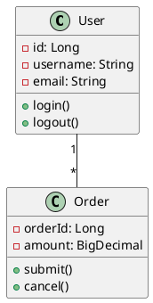
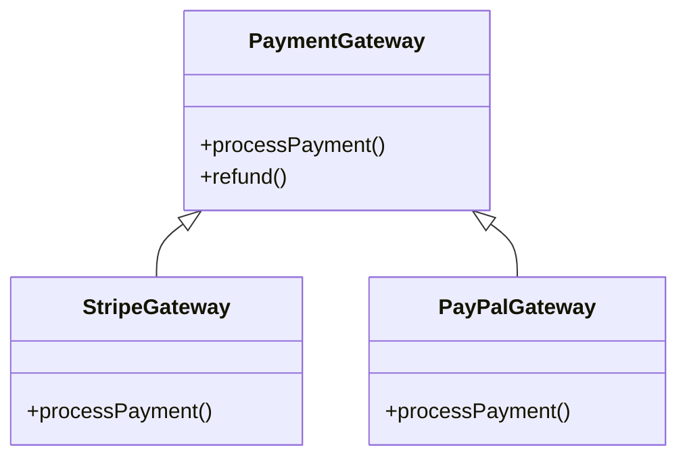

# Software Development Environment and Tools
# 系统开发基础知识软件开发环境与工具之开发工具

## Table of Contents | 目录

1. [Overview](#overview)
2. [Modeling Tools](#modeling-tools)
3. [Analysis and Design Tools](#analysis-design-tools)
4. [Programming Tools](#programming-tools)
5. [Testing Tools](#testing-tools)
6. [Project Management Tools](#project-management-tools)
7. [DevOps and CI/CD Tools](#devops-cicd-tools)
8. [Tool Selection and Integration](#tool-selection)
9. [Emerging Trends](#emerging-trends)
10. [Best Practices](#best-practices)

---

## 1. Overview

### 1.1 The Software Development Toolchain | 软件开发工具链

Modern software development relies on an integrated ecosystem of tools spanning the entire development lifecycle:

现代软件开发依赖于涵盖整个开发生命周期的集成工具生态系统：

```
Requirements → Design → Development → Testing → Deployment → Operations
     ↓           ↓          ↓            ↓          ↓            ↓
 Modeling    Design     IDE/         Testing    CI/CD      Monitoring
   Tools      Tools    Editors       Tools      Tools        Tools
```

### 1.2 Tool Categories | 工具类别

**Development Lifecycle Tools | 开发生命周期工具**
- Requirements and modeling
- Analysis and design
- Programming and coding
- Testing and quality assurance
- Build and deployment
- Project management
- Monitoring and operations

**Cross-Cutting Tools | 横切工具**
- Version control
- Collaboration and communication
- Documentation
- Security and compliance

### 1.3 Key Considerations | 关键考虑因素

When selecting development tools:

选择开发工具时：

- **Integration**: How well tools work together
- **Scalability**: Support for team and project growth
- **Learning Curve**: Time to productivity
- **Cost**: Licensing, maintenance, training
- **Support**: Community, documentation, vendor support
- **Flexibility**: Customization and extensibility
- **Compliance**: Security, audit, regulatory requirements

---

## 2. Modeling Tools

### 2.1 UML Modeling Tools | UML建模工具

**Purpose**: Create visual representations of system architecture, design, and behavior using Unified Modeling Language.

**目的**：使用统一建模语言创建系统架构、设计和行为的可视化表示。

#### 2.1.1 Enterprise Architect (Sparx Systems)

**Overview**: Comprehensive enterprise modeling platform

**概述**：全面的企业建模平台

**Key Features**:
- Full UML 2.5 support (all 14 diagram types)
- Business process modeling (BPMN 2.0)
- Database modeling and generation
- Requirements management
- Code engineering (forward and reverse)
- Team collaboration and version control
- Simulation and model execution

**主要功能**：
- 完整UML 2.5支持（所有14种图表类型）
- 业务流程建模（BPMN 2.0）
- 数据库建模和生成
- 需求管理
- 代码工程（正向和逆向）
- 团队协作和版本控制
- 仿真和模型执行

**Use Cases**:
- Enterprise architecture design
- System and software architecture
- Database schema design
- Requirements traceability

**Pricing**: Commercial (starts ~$159/user/year)

**定价**：商业版（约$159/用户/年起）

#### 2.1.2 Visual Paradigm

**Overview**: User-friendly UML and agile development platform

**概述**：用户友好的UML和敏捷开发平台

**Key Features**:
- UML, BPMN, ERD, DFD diagrams
- Agile story mapping and sprint planning
- Code generation (Java, C++, C#, Python, etc.)
- Database design and synchronization
- Report generation
- Real-time collaboration
- Cloud and desktop versions

**主要功能**：
- UML、BPMN、ERD、DFD图表
- 敏捷故事地图和迭代规划
- 代码生成（Java、C++、C#、Python等）
- 数据库设计和同步
- 报告生成
- 实时协作
- 云和桌面版本

**Pricing**: Tiered (Modeler: $99, Standard: $299, Professional: $599)

**定价**：分级定价（建模器：$99，标准：$299，专业：$599）

#### 2.1.3 StarUML

**Overview**: Fast and lightweight UML tool

**概述**：快速轻量的UML工具

**Key Features**:
- UML 2.x diagrams
- ERD, flowchart support
- Code engineering for multiple languages
- Extension support
- Cross-platform (Windows, macOS, Linux)

**Advantages**: 
- Affordable ($89 one-time)
- Clean interface
- Fast performance

**Limitations**:
- Limited team collaboration features
- Smaller ecosystem than enterprise tools

**优势**：
- 价格实惠（$89一次性）
- 简洁界面
- 快速性能

**局限性**：
- 团队协作功能有限
- 生态系统小于企业级工具

#### 2.1.4 PlantUML

**Overview**: Text-based diagram generation

**概述**：基于文本的图表生成

**Key Features**:
- Write diagrams as code
- Version control friendly
- Supports UML, ERD, Gantt, mind maps
- Integration with IDEs, wikis, documentation tools
- Open source and free

**主要功能**：
- 以代码形式编写图表
- 版本控制友好
- 支持UML、ERD、甘特图、思维导图
- 与IDE、wiki、文档工具集成
- 开源免费

**Example**:


**Use Cases**:
- Documentation in Markdown/Wiki
- CI/CD diagram generation
- Lightweight modeling without GUI

**适用场景**：
- Markdown/Wiki中的文档
- CI/CD图表生成
- 无需GUI的轻量建模

#### 2.1.5 Mermaid

**Overview**: Modern text-based diagramming embedded in Markdown

**概述**：嵌入Markdown的现代文本图表工具

**Syntax Example**:


**Advantages**:
- Native GitHub/GitLab support
- No installation required
- Live preview in many editors
- Open source

**优势**：
- GitHub/GitLab原生支持
- 无需安装
- 多数编辑器实时预览
- 开源

### 2.2 Business Process Modeling | 业务流程建模

#### 2.2.1 BPMN Tools | BPMN工具

**Camunda Modeler**
- Open-source BPMN 2.0 editor
- Integration with Camunda workflow engine
- Execution-ready process models

**Bizagi Modeler**
- Free BPMN modeling
- Process simulation
- Documentation generation
- Collaboration features

**Microsoft Visio**
- BPMN templates
- Integration with Office suite
- Widely used in enterprises

### 2.3 Data Modeling Tools | 数据建模工具

#### 2.3.1 Database Design Tools | 数据库设计工具

**MySQL Workbench**
- Free, official MySQL tool
- Visual database design
- SQL development
- Database administration
- Forward/reverse engineering

**pgAdmin**
- PostgreSQL management and design
- ER diagram support
- Query tool and debugger

**DbSchema**
- Universal database designer
- Visual query builder
- Database documentation
- Supports 40+ databases

**ER/Studio**
- Enterprise data modeling
- Data governance
- Collaboration and versioning
- Multi-platform support

#### 2.3.2 Comparison Table | 对比表

| Tool                 | Type        | Platforms           | Price | Best For                |
| -------------------- | ----------- | ------------------- | ----- | ----------------------- |
| Enterprise Architect | Commercial  | Windows, Mac, Linux | $$$   | Enterprise architecture |
| Visual Paradigm      | Commercial  | Cross-platform      | $$    | Agile teams             |
| StarUML              | Commercial  | Cross-platform      | $     | Individual/small teams  |
| PlantUML             | Open Source | All (Java)          | Free  | Documentation as code   |
| Mermaid              | Open Source | Web-based           | Free  | Markdown documentation  |

---

## 3. Analysis and Design Tools {#analysis-design-tools}

### 3.1 Requirements Analysis Tools | 需求分析工具

#### 3.1.1 IBM Engineering Requirements Management DOORS Next

**Overview**: Enterprise requirements management

**概述**：企业需求管理

**Features**:
- Requirements capture and traceability
- Impact analysis
- Collaboration and review workflows
- Compliance and audit support
- Integration with testing and development tools

**功能**：
- 需求捕获和可追溯性
- 影响分析
- 协作和审查工作流
- 合规和审计支持
- 与测试和开发工具集成

#### 3.1.2 Jama Connect

**Features**:
- Product development platform
- Requirements, test, and risk management
- Real-time collaboration
- Traceability and coverage analysis

### 3.2 Prototyping and Wireframing Tools | 原型和线框图工具

#### 3.2.1 Figma

**Overview**: Cloud-based design and prototyping platform

**概述**：基于云的设计和原型平台

**Key Features**:
- Real-time collaboration (multiple users simultaneously)
- Vector graphics editor
- Interactive prototyping
- Design systems and components
- Developer handoff with code snippets
- Plugin ecosystem
- Version history

**主要功能**：
- 实时协作（多用户同时编辑）
- 矢量图形编辑器
- 交互式原型
- 设计系统和组件
- 开发者交接与代码片段
- 插件生态系统
- 版本历史

**Pricing**: Free tier + paid plans ($12-45/editor/month)

**定价**：免费版 + 付费计划（$12-45/编辑者/月）

**Use Cases**:
- UI/UX design
- Mobile and web application mockups
- Design collaboration
- Design-to-development handoff

#### 3.2.2 Adobe XD

**Features**:
- Vector design and wireframing
- Interactive prototypes
- Auto-animate transitions
- Voice prototyping
- Coediting (real-time collaboration)
- Adobe Creative Cloud integration

**功能**：
- 矢量设计和线框图
- 交互式原型
- 自动动画转换
- 语音原型
- 协同编辑（实时协作）
- Adobe Creative Cloud集成

**Pricing**: Included with Creative Cloud ($54.99/month)

#### 3.2.3 Sketch

**Overview**: Mac-only design tool (industry standard for years)

**概述**：Mac专用设计工具（多年行业标准）

**Features**:
- Vector editing
- Symbols and reusable components
- Plugin ecosystem
- Cloud collaboration (Sketch Cloud)
- Developer handoff

**Pricing**: $99/year per user

#### 3.2.4 Balsamiq

**Overview**: Low-fidelity wireframing tool

**概述**：低保真线框图工具

**Features**:
- Rapid wireframing
- Hand-drawn sketch aesthetic
- UI component library
- Simple and focused on structure

**Advantages**:
- Quick mockups
- Focus on functionality over aesthetics
- Prevents over-design in early stages

**优势**：
- 快速原型
- 专注功能而非美学
- 防止早期阶段过度设计

**Pricing**: $89/year (desktop), $9/month (cloud)

#### 3.2.5 Tool Comparison | 工具对比

| Tool     | Platform       | Collaboration         | Prototyping | Best For                  |
| -------- | -------------- | --------------------- | ----------- | ------------------------- |
| Figma    | Web, Desktop   | Excellent (real-time) | Advanced    | Teams, web/mobile UI      |
| Adobe XD | Desktop        | Good                  | Advanced    | Adobe users, voice UI     |
| Sketch   | Mac only       | Good (cloud)          | Advanced    | Mac users, design systems |
| Balsamiq | Cross-platform | Limited               | Basic       | Rapid wireframes          |

### 3.3 Diagramming Tools | 图表工具

#### 3.3.1 Microsoft Visio

**Overview**: Industry-standard diagramming tool

**概述**：行业标准图表工具

**Features**:
- Flowcharts, network diagrams, org charts
- Integration with Office 365
- Data visualization (connect diagrams to data)
- Collaboration via SharePoint
- Extensive template library

**功能**：
- 流程图、网络图、组织图
- 与Office 365集成
- 数据可视化（将图表连接到数据）
- 通过SharePoint协作
- 丰富的模板库

**Pricing**: $5-15/user/month (Plan 1/2)

#### 3.3.2 draw.io (diagrams.net)

**Overview**: Free, open-source diagramming tool

**概述**：免费开源图表工具

**Features**:
- Web-based and desktop versions
- Save to Google Drive, OneDrive, GitHub
- No registration required
- Extensive shape libraries
- Export to PNG, SVG, PDF, XML

**主要功能**：
- 基于Web和桌面版本
- 保存到Google Drive、OneDrive、GitHub
- 无需注册
- 丰富的形状库
- 导出为PNG、SVG、PDF、XML

**Use Cases**:
- Free alternative to Visio
- Technical diagrams for documentation
- Embedded diagrams in wikis

**适用场景**：
- Visio的免费替代品
- 文档技术图表
- wiki中嵌入的图表

#### 3.3.3 Lucidchart

**Overview**: Cloud-based diagramming with collaboration

**概述**：基于云的协作图表工具

**Features**:
- Real-time collaboration
- Data linking and visualization
- Integration with Google Workspace, Microsoft, Atlassian
- Templates for various diagram types
- Presentation mode

**功能**：
- 实时协作
- 数据链接和可视化
- 与Google Workspace、Microsoft、Atlassian集成
- 各种图表类型的模板
- 演示模式

**Pricing**: Free tier + $7.95-27/user/month

#### 3.3.4 Miro

**Overview**: Online collaborative whiteboard

**概述**：在线协作白板

**Features**:
- Infinite canvas
- Real-time collaboration
- Templates (flowcharts, mind maps, Kanban)
- Sticky notes and brainstorming
- Integration with 100+ tools

**功能**：
- 无限画布
- 实时协作
- 模板（流程图、思维导图、看板）
- 便签和头脑风暴
- 与100+工具集成

**Use Cases**:
- Brainstorming sessions
- Agile retrospectives
- Process mapping
- Remote team workshops

**适用场景**：
- 头脑风暴会议
- 敏捷回顾
- 流程映射
- 远程团队研讨会

---

## 4. Programming Tools

### 4.1 Integrated Development Environments (IDEs) | 集成开发环境

#### 4.1.1 IntelliJ IDEA (JetBrains)

**Overview**: Leading Java IDE, also supports many other languages

**概述**：领先的Java IDE，也支持许多其他语言

**Key Features**:
- Intelligent code completion
- Advanced refactoring
- Built-in version control
- Database tools
- Framework support (Spring, Jakarta EE, etc.)
- Debugger and profiler
- Plugin marketplace

**主要功能**：
- 智能代码补全
- 高级重构
- 内置版本控制
- 数据库工具
- 框架支持（Spring、Jakarta EE等）
- 调试器和分析器
- 插件市场

**Editions**:
- Community (Free, open-source)
- Ultimate (Commercial, $149-599/year)

**版本**：
- 社区版（免费、开源）
- 旗舰版（商业版，$149-599/年）

**Best For**: Java, Kotlin, Scala, Groovy development

**最适合**：Java、Kotlin、Scala、Groovy开发

#### 4.1.2 Eclipse

**Overview**: Open-source, extensible IDE

**概述**：开源、可扩展的IDE

**Features**:
- Java development (primary focus)
- Plugin architecture (supports C/C++, PHP, Python via plugins)
- Maven and Gradle integration
- Git integration
- Debugging and profiling
- Free and open-source

**功能**：
- Java开发（主要焦点）
- 插件架构（通过插件支持C/C++、PHP、Python）
- Maven和Gradle集成
- Git集成
- 调试和性能分析
- 免费开源

**Advantages**: Free, large ecosystem, highly customizable

**优势**：免费、大型生态系统、高度可定制

**Drawbacks**: Can be slower than modern IDEs, complex setup

**缺点**：可能比现代IDE慢，设置复杂

#### 4.1.3 Visual Studio

**Overview**: Microsoft's flagship IDE for .NET development

**概述**：微软的旗舰.NET开发IDE

**Features**:
- .NET, C#, VB.NET, F# development
- C++ development
- Azure integration
- IntelliSense (code completion)
- Live Share (real-time collaboration)
- Extensive debugging tools
- Profiling and diagnostics

**功能**：
- .NET、C#、VB.NET、F#开发
- C++开发
- Azure集成
- IntelliSense（代码补全）
- Live Share（实时协作）
- 丰富的调试工具
- 性能分析和诊断

**Editions**:
- Community (Free for individuals and small teams)
- Professional ($45/month)
- Enterprise ($250/month)

**版本**：
- 社区版（个人和小团队免费）
- 专业版（$45/月）
- 企业版（$250/月）

#### 4.1.4 Xcode

**Overview**: Apple's IDE for iOS, macOS, watchOS, tvOS development

**概述**：苹果的iOS、macOS、watchOS、tvOS开发IDE

**Features**:
- Swift and Objective-C support
- Interface Builder (visual UI design)
- iOS Simulator
- Instruments (performance profiling)
- SwiftUI preview
- TestFlight integration
- Free (requires Mac)

**功能**：
- Swift和Objective-C支持
- Interface Builder（可视化UI设计）
- iOS模拟器
- Instruments（性能分析）
- SwiftUI预览
- TestFlight集成
- 免费（需要Mac）

#### 4.1.5 PyCharm (JetBrains)

**Overview**: Python-focused IDE

**概述**：专注Python的IDE

**Features**:
- Intelligent Python code assistance
- Web development (Django, Flask)
- Scientific tools (Jupyter, NumPy, Matplotlib)
- Database tools
- Remote development
- Docker and Kubernetes support

**功能**：
- 智能Python代码辅助
- Web开发（Django、Flask）
- 科学工具（Jupyter、NumPy、Matplotlib）
- 数据库工具
- 远程开发
- Docker和Kubernetes支持

**Editions**: Community (Free), Professional ($89-199/year)

**版本**：社区版（免费），专业版（$89-199/年）

### 4.2 Code Editors | 代码编辑器

#### 4.2.1 Visual Studio Code (VS Code)

**Overview**: Lightweight, extensible code editor (most popular)

**概述**：轻量级、可扩展的代码编辑器（最受欢迎）

**Key Features**:
- IntelliSense (code completion)
- Built-in Git integration
- Debugging support
- Extensions marketplace (60,000+ extensions)
- Remote development (SSH, WSL, containers)
- Live Share collaboration
- Terminal integration
- Multi-language support
- Free and open-source

**主要功能**：
- IntelliSense（代码补全）
- 内置Git集成
- 调试支持
- 扩展市场（60,000+扩展）
- 远程开发（SSH、WSL、容器）
- Live Share协作
- 终端集成
- 多语言支持
- 免费开源

**Popular Extensions**:
- ESLint, Prettier (code quality)
- GitLens (Git supercharged)
- Python, Java Extension Pack
- Docker, Kubernetes
- GitHub Copilot (AI assistant)

**热门扩展**：
- ESLint、Prettier（代码质量）
- GitLens（增强Git）
- Python、Java扩展包
- Docker、Kubernetes
- GitHub Copilot（AI助手）

**Use Cases**: 
- Web development (JavaScript, TypeScript, HTML, CSS)
- Python, Go, Rust development
- General-purpose coding
- DevOps scripting

**适用场景**：
- Web开发（JavaScript、TypeScript、HTML、CSS）
- Python、Go、Rust开发
- 通用编码
- DevOps脚本

#### 4.2.2 Sublime Text

**Features**:
- Extremely fast and lightweight
- Multiple cursors
- Command palette
- Plugin API (Package Control)
- Cross-platform

**功能**：
- 极快且轻量
- 多光标
- 命令面板
- 插件API（Package Control）
- 跨平台

**Pricing**: $99 (unlimited trial, periodic purchase reminders)

**定价**：$99（无限试用，定期购买提醒）

**Best For**: Users who prioritize speed and simplicity

**最适合**：优先考虑速度和简洁的用户

#### 4.2.3 Atom

**Overview**: GitHub's hackable text editor (deprecated in 2022, superseded by VS Code)

**概述**：GitHub的可定制文本编辑器（2022年弃用，由VS Code取代）

**Note**: Development ceased; users migrating to VS Code

**注意**：开发已停止；用户迁移到VS Code

#### 4.2.4 Vim / Neovim

**Overview**: Terminal-based, highly efficient editor

**概述**：基于终端的高效编辑器

**Features**:
- Modal editing (command mode, insert mode)
- Keyboard-centric workflow
- Highly customizable (Vimscript, Lua)
- Extensible with plugins
- Available on all platforms
- Free and open-source

**功能**：
- 模式编辑（命令模式、插入模式）
- 以键盘为中心的工作流
- 高度可定制（Vimscript、Lua）
- 插件可扩展
- 所有平台可用
- 免费开源

**Learning Curve**: Steep but rewarding for power users

**学习曲线**：陡峭但对高级用户有回报

#### 4.2.5 IDE vs. Editor Comparison | IDE与编辑器对比

| Aspect               | IDEs (IntelliJ, Visual Studio)          | Editors (VS Code, Sublime)       |
| -------------------- | --------------------------------------- | -------------------------------- |
| **Weight**           | Heavy, resource-intensive               | Lightweight, fast startup        |
| **Features**         | All-in-one, comprehensive               | Minimal, extensible              |
| **Setup**            | Works out-of-box                        | Requires extension configuration |
| **Language Support** | Deep integration for specific languages | Broad, plugin-based              |
| **Best For**         | Large projects, complex debugging       | Quick edits, scripting, web dev  |

### 4.3 Version Control Systems | 版本控制系统

#### 4.3.1 Git

**Overview**: Distributed version control system (industry standard)

**概述**：分布式版本控制系统（行业标准）

**Key Concepts**:
- **Repository**: Project storage
- **Commit**: Snapshot of changes
- **Branch**: Independent line of development
- **Merge**: Combine branches
- **Remote**: Server-hosted repository

**关键概念**：
- **仓库**：项目存储
- **提交**：变更快照
- **分支**：独立的开发线
- **合并**：合并分支
- **远程**：服务器托管的仓库

**Basic Commands**:
```bash
git init                  # Initialize repository
git clone <url>           # Clone remote repository
git add <file>            # Stage changes
git commit -m "message"   # Commit changes
git push origin main      # Push to remote
git pull origin main      # Pull from remote
git branch <name>         # Create branch
git checkout <branch>     # Switch branch
git merge <branch>        # Merge branch
```

**Advantages**:
- Fast and efficient
- Distributed (local operations)
- Branching and merging
- Open source
- Huge ecosystem

**优势**：
- 快速高效
- 分布式（本地操作）
- 分支和合并
- 开源
- 庞大生态系统

#### 4.3.2 Subversion (SVN)

**Overview**: Centralized version control system

**概述**：集中式版本控制系统

**Characteristics**:
- Single central repository
- Simpler mental model (linear history)
- Better handling of large binary files
- Atomic commits

**特征**：
- 单一中央仓库
- 更简单的思维模型（线性历史）
- 更好地处理大型二进制文件
- 原子提交

**Use Cases**: Legacy systems, organizations with centralized workflows

**适用场景**：遗留系统、采用集中式工作流的组织

#### 4.3.3 Mercurial

**Overview**: Distributed VCS similar to Git

**概述**：类似Git的分布式VCS

**Status**: Declining usage, Git has become dominant

**状态**：使用量下降，Git已占主导地位

### 4.4 Code Repository Platforms | 代码仓库平台

#### 4.4.1 GitHub

**Overview**: Largest code hosting platform (owned by Microsoft)

**概述**：最大的代码托管平台（微软拥有）

**Features**:
- Git hosting
- Pull requests and code review
- Issues and project boards
- GitHub Actions (CI/CD)
- GitHub Packages (package registry)
- Codespaces (cloud development)
- Copilot (AI coding assistant)
- Large open-source community

**功能**：
- Git托管
- Pull请求和代码审查
- 问题和项目看板
- GitHub Actions（CI/CD）
- GitHub Packages（包注册表）
- Codespaces（云开发）
- Copilot（AI编码助手）
- 大型开源社区

**Pricing**: 
- Free (public and private repos)
- Team ($4/user/month)
- Enterprise ($21/user/month)

**定价**：
- 免费（公共和私有仓库）
- 团队版（$4/用户/月）
- 企业版（$21/用户/月）

#### 4.4.2 GitLab

**Overview**: Complete DevOps platform

**概述**：完整的DevOps平台

**Features**:
- Git repository management
- CI/CD pipelines (GitLab CI)
- Container registry
- Kubernetes integration
- Security scanning (SAST, DAST, dependency scanning)
- Issue tracking and project management
- Self-hosted option

**功能**：
- Git仓库管理
- CI/CD流水线（GitLab CI）
- 容器注册表
- Kubernetes集成
- 安全扫描（SAST、DAST、依赖扫描）
- 问题跟踪和项目管理
- 自托管选项

**Pricing**:
- Free tier
- Premium ($29/user/month)
- Ultimate ($99/user/month)

**定价**：
- 免费版
- 高级版（$29/用户/月）
- 旗舰版（$99/用户/月）

**Advantage**: All-in-one DevOps, self-hosting option

**优势**：一体化DevOps，自托管选项

#### 4.4.3 Bitbucket

**Overview**: Atlassian's Git platform

**概述**：Atlassian的Git平台

**Features**:
- Git and Mercurial hosting
- Pull requests and code review
- Bitbucket Pipelines (CI/CD)
- Integration with Jira and Confluence
- IP whitelisting and required 2FA (security)

**功能**：
- Git和Mercurial托管
- Pull请求和代码审查
- Bitbucket Pipelines（CI/CD）
- 与Jira和Confluence集成
- IP白名单和强制2FA（安全）

**Pricing**: Free for small teams (up to 5 users), then $3-6/user/month

**定价**：小团队免费（最多5用户），然后$3-6/用户/月

**Best For**: Teams using Atlassian suite (Jira, Confluence)

**最适合**：使用Atlassian套件的团队（Jira、Confluence）

#### 4.4.4 Azure Repos

**Overview**: Part of Azure DevOps Services

**概述**：Azure DevOps Services的一部分

**Features**:
- Git and TFVC (Team Foundation Version Control)
- Pull requests and branch policies
- Integration with Azure Pipelines
- Microsoft ecosystem integration

**功能**：
- Git和TFVC（Team Foundation版本控制）
- Pull请求和分支策略
- 与Azure Pipelines集成
- Microsoft生态系统集成

**Best For**: Organizations using Microsoft Azure and .NET

**最适合**：使用Microsoft Azure和.NET的组织

### 4.5 Code Quality Tools | 代码质量工具

#### 4.5.1 SonarQube

**Overview**: Continuous code quality and security inspection

**概述**：持续代码质量和安全检查

**Features**:
- Static code analysis for 25+ languages
- Bug and vulnerability detection
- Code smells and technical debt tracking
- Quality gates
- Integration with CI/CD pipelines
- Dashboard and reporting

**功能**：
- 25+语言的静态代码分析
- Bug和漏洞检测
- 代码异味和技术债务跟踪
- 质量门禁
- 与CI/CD流水线集成
- 仪表板和报告

**Editions**:
- Community (Free, open-source)
- Developer, Enterprise (Commercial)

**版本**：
- 社区版（免费、开源）
- 开发者版、企业版（商业版）

#### 4.5.2 ESLint (JavaScript)

**Overview**: Pluggable linting utility for JavaScript

**概述**：JavaScript的可插拔lint工具

**Features**:
- Find and fix problems in JavaScript code
- Configurable rules
- Plugin ecosystem
- Integration with editors and build tools

**功能**：
- 查找并修复JavaScript代码问题
- 可配置规则
- 插件生态系统
- 与编辑器和构建工具集成

**Configuration Example**:
```json
{
  "extends": "eslint:recommended",
  "rules": {
    "no-unused-vars": "error",
    "semi": ["error", "always"]
  }
}
```

#### 4.5.3 Checkstyle (Java)

**Overview**: Java code style checker

**概述**：Java代码风格检查器

**Features**:
- Enforce coding standards
- Customizable rules
- Maven/Gradle integration
- IDE plugins

**功能**：
- 强制编码标准
- 可定制规则
- Maven/Gradle集成
- IDE插件

#### 4.5.4 ReSharper (C#)

**Overview**: JetBrains productivity extension for Visual Studio

**概述**：JetBrains为Visual Studio提供的生产力扩展

**Features**:
- Code analysis and refactoring
- Code generation
- Navigation and search
- Unit test runner
- Decompiler

**功能**：
- 代码分析和重构
- 代码生成
- 导航和搜索
- 单元测试运行器
- 反编译器

**Pricing**: $149-399/year

### 4.6 API Development Tools | API开发工具

#### 4.6.1 Postman

**Overview**: API development and testing platform

**概述**：API开发和测试平台

**Features**:
- Send HTTP requests (GET, POST, PUT, DELETE, etc.)
- Environment variables
- Test scripting
- API mocking
- Documentation generation
- Team collaboration
- Automated testing

**功能**：
- 发送HTTP请求（GET、POST、PUT、DELETE等）
- 环境变量
- 测试脚本
- API模拟
- 文档生成
- 团队协作
- 自动化测试

**Pricing**: Free tier + paid plans ($12-49/user/month)

#### 4.6.2 Insomnia

**Overview**: Simplified API client

**概述**：简化的API客户端

**Features**:
- Clean interface
- GraphQL support
- Environment management
- Code generation
- Plugin support

**功能**：
- 简洁界面
- GraphQL支持
- 环境管理
- 代码生成
- 插件支持

**Pricing**: Free + paid plans

#### 4.6.3 Swagger / OpenAPI

**Overview**: API specification and documentation

**概述**：API规范和文档

**Tools**:
- **Swagger Editor**: Write OpenAPI specs
- **Swagger UI**: Interactive API documentation
- **Swagger Codegen**: Generate client SDKs and server stubs

**工具**：
- **Swagger编辑器**：编写OpenAPI规范
- **Swagger UI**：交互式API文档
- **Swagger Codegen**：生成客户端SDK和服务器存根

**Example OpenAPI Spec**:
```yaml
openapi: 3.0.0
info:
  title: User API
  version: 1.0.0
paths:
  /users:
    get:
      summary: Get all users
      responses:
        '200':
          description: Successful response
          content:
            application/json:
              schema:
                type: array
                items:
                  $ref: '#/components/schemas/User'
components:
  schemas:
    User:
      type: object
      properties:
        id:
          type: integer
        username:
          type: string
```

---

## 5. Testing Tools

### 5.1 Unit Testing Frameworks | 单元测试框架

#### 5.1.1 JUnit (Java)

**Overview**: De facto standard for Java unit testing

**概述**：Java单元测试的事实标准

**Features**:
- Annotations for test methods
- Assertions library
- Test lifecycle management
- Parameterized tests
- Integration with IDEs and build tools

**功能**：
- 测试方法的注解
- 断言库
- 测试生命周期管理
- 参数化测试
- 与IDE和构建工具集成

**Example**:
```java
import org.junit.jupiter.api.Test;
import static org.junit.jupiter.api.Assertions.*;

public class CalculatorTest {
    @Test
    public void testAdd() {
        Calculator calc = new Calculator();
        assertEquals(5, calc.add(2, 3));
    }
    
    @Test
    public void testDivideByZero() {
        Calculator calc = new Calculator();
        assertThrows(ArithmeticException.class, () -> {
            calc.divide(10, 0);
        });
    }
}
```

#### 5.1.2 NUnit (C# / .NET)

**Overview**: Unit testing framework for .NET

**概述**：.NET的单元测试框架

**Features**:
- Attribute-based test definition
- Assertions
- Test fixtures and setup/teardown
- Data-driven tests
- Parallel execution

**功能**：
- 基于特性的测试定义
- 断言
- 测试夹具和设置/清理
- 数据驱动测试
- 并行执行

**Example**:
```csharp
using NUnit.Framework;

[TestFixture]
public class CalculatorTests
{
    [Test]
    public void Add_TwoNumbers_ReturnsSum()
    {
        var calculator = new Calculator();
        Assert.AreEqual(5, calculator.Add(2, 3));
    }
}
```

#### 5.1.3 pytest (Python)

**Overview**: Popular Python testing framework

**概述**：流行的Python测试框架

**Features**:
- Simple syntax (no boilerplate)
- Powerful fixtures
- Parameterized testing
- Plugin architecture
- Detailed assertion introspection

**功能**：
- 简单语法（无样板代码）
- 强大的夹具
- 参数化测试
- 插件架构
- 详细的断言内省

**Example**:
```python
def test_add():
    assert add(2, 3) == 5

def test_divide_by_zero():
    with pytest.raises(ZeroDivisionError):
        divide(10, 0)

@pytest.mark.parametrize("a,b,expected", [
    (2, 3, 5),
    (0, 0, 0),
    (-1, 1, 0)
])
def test_add_parametrized(a, b, expected):
    assert add(a, b) == expected
```

#### 5.1.4 Jest (JavaScript)

**Overview**: JavaScript testing framework (React ecosystem)

**概述**：JavaScript测试框架（React生态系统）

**Features**:
- Zero configuration
- Snapshot testing
- Mocking support
- Code coverage
- Parallel test execution
- Watch mode

**功能**：
- 零配置
- 快照测试
- 模拟支持
- 代码覆盖率
- 并行测试执行
- 监视模式

**Example**:
```javascript
test('adds 1 + 2 to equal 3', () => {
  expect(sum(1, 2)).toBe(3);
});

test('object assignment', () => {
  const data = {one: 1};
  data['two'] = 2;
  expect(data).toEqual({one: 1, two: 2});
});
```

#### 5.1.5 Mocha (JavaScript)

**Overview**: Flexible JavaScript test framework

**概述**：灵活的JavaScript测试框架

**Features**:
- Runs on Node.js and browser
- Asynchronous testing
- Flexible (use with assertion libraries like Chai)
- Hooks for setup/teardown

**功能**：
- 在Node.js和浏览器中运行
- 异步测试
- 灵活（与Chai等断言库配合使用）
- 设置/清理的钩子

### 5.2 End-to-End Testing Tools | 端到端测试工具

#### 5.2.1 Selenium

**Overview**: Browser automation framework (industry standard)

**概述**：浏览器自动化框架（行业标准）

**Components**:
- **Selenium WebDriver**: Browser automation API
- **Selenium IDE**: Record/playback tool
- **Selenium Grid**: Parallel execution across browsers

**组件**：
- **Selenium WebDriver**：浏览器自动化API
- **Selenium IDE**：录制/回放工具
- **Selenium Grid**：跨浏览器并行执行

**Supported Languages**: Java, Python, C#, JavaScript, Ruby

**支持的语言**：Java、Python、C#、JavaScript、Ruby

**Example (Python)**:
```python
from selenium import webdriver
from selenium.webdriver.common.by import By

driver = webdriver.Chrome()
driver.get("https://example.com")
search_box = driver.find_element(By.NAME, "q")
search_box.send_keys("Selenium")
search_box.submit()
assert "Selenium" in driver.title
driver.quit()
```

**Advantages**:
- Cross-browser support (Chrome, Firefox, Safari, Edge)
- Mature ecosystem
- Large community

**优势**：
- 跨浏览器支持（Chrome、Firefox、Safari、Edge）
- 成熟生态系统
- 大型社区

**Drawbacks**:
- Setup complexity
- Slower than modern alternatives
- Flaky tests common

**缺点**：
- 设置复杂
- 比现代替代品慢
- 测试不稳定常见

#### 5.2.2 Cypress

**Overview**: Modern end-to-end testing framework

**概述**：现代端到端测试框架

**Features**:
- Fast execution (runs in browser)
- Real-time reloading
- Automatic waiting (no explicit waits)
- Time-travel debugging
- Network stubbing
- Video and screenshot capture

**功能**：
- 快速执行（在浏览器中运行）
- 实时重新加载
- 自动等待（无需显式等待）
- 时间旅行调试
- 网络存根
- 视频和截图捕获

**Example**:
```javascript
describe('Login Test', () => {
  it('should login successfully', () => {
    cy.visit('https://example.com/login')
    cy.get('#username').type('user@example.com')
    cy.get('#password').type('password123')
    cy.get('button[type="submit"]').click()
    cy.url().should('include', '/dashboard')
    cy.contains('Welcome').should('be.visible')
  })
})
```

**Advantages**:
- Developer-friendly
- Fast and reliable
- Great debugging experience

**优势**：
- 对开发者友好
- 快速可靠
- 出色的调试体验

**Limitations**:
- Limited browser support (Chromium, Firefox, Edge; no Safari native support)
- Runs in browser (some limitations for multi-tab/domain scenarios)

**限制**：
- 浏览器支持有限（Chromium、Firefox、Edge；无Safari原生支持）
- 在浏览器中运行（多标签/域场景有些限制）

#### 5.2.3 Playwright

**Overview**: Microsoft's cross-browser automation library

**概述**：微软的跨浏览器自动化库

**Features**:
- Supports Chromium, Firefox, WebKit (Safari)
- Multi-browser, multi-page, multi-origin
- Auto-waiting and retry
- Network interception
- Mobile emulation
- Headless and headed modes
- Fast execution

**功能**：
- 支持Chromium、Firefox、WebKit（Safari）
- 多浏览器、多页面、多源
- 自动等待和重试
- 网络拦截
- 移动模拟
- 无头和有头模式
- 快速执行

**Example**:
```javascript
const { test, expect } = require('@playwright/test');

test('basic test', async ({ page }) => {
  await page.goto('https://example.com');
  await page.click('text=Login');
  await page.fill('#username', 'user@example.com');
  await page.fill('#password', 'password123');
  await page.click('button:has-text("Submit")');
  await expect(page).toHaveURL(/.*dashboard/);
});
```

**Advantages**:
- True cross-browser (including WebKit)
- Modern API and features
- Fast and reliable

**优势**：
- 真正的跨浏览器（包括WebKit）
- 现代API和功能
- 快速可靠

#### 5.2.4 Puppeteer

**Overview**: Node.js library for Chrome/Chromium automation

**概述**：用于Chrome/Chromium自动化的Node.js库

**Features**:
- Headless Chrome automation
- Maintained by Chrome DevTools team
- Screenshot and PDF generation
- Performance profiling
- DevTools Protocol access

**功能**：
- 无头Chrome自动化
- Chrome DevTools团队维护
- 截图和PDF生成
- 性能分析
- DevTools协议访问

**Use Cases**:
- Web scraping
- Automated testing
- Screenshot generation
- Performance monitoring

**适用场景**：
- 网页爬取
- 自动化测试
- 截图生成
- 性能监控

**Limitation**: Chromium-only (for multi-browser, use Playwright)

**限制**：仅Chromium（多浏览器请使用Playwright）

### 5.3 Performance Testing Tools | 性能测试工具

#### 5.3.1 Apache JMeter

**Overview**: Open-source load testing tool

**概述**：开源负载测试工具

**Features**:
- HTTP/HTTPS, FTP, JDBC, SOAP/REST testing
- Distributed testing
- Flexible test plans (GUI and CLI)
- Reporting and visualization
- Extensible via plugins

**功能**：
- HTTP/HTTPS、FTP、JDBC、SOAP/REST测试
- 分布式测试
- 灵活的测试计划（GUI和CLI）
- 报告和可视化
- 通过插件可扩展

**Use Cases**:
- Load testing web applications
- Performance regression testing
- API stress testing

**适用场景**：
- Web应用负载测试
- 性能回归测试
- API压力测试

#### 5.3.2 Gatling

**Overview**: Modern load testing framework (Scala-based)

**概述**：现代负载测试框架（基于Scala）

**Features**:
- Code-based test scenarios (Scala DSL)
- High performance (asynchronous, non-blocking)
- Real-time metrics
- Rich HTML reports
- CI/CD integration

**功能**：
- 基于代码的测试场景（Scala DSL）
- 高性能（异步、非阻塞）
- 实时度量
- 丰富的HTML报告
- CI/CD集成

**Example**:
```scala
import io.gatling.core.Predef._
import io.gatling.http.Predef._

class BasicSimulation extends Simulation {
  val httpProtocol = http.baseUrl("https://example.com")
  
  val scn = scenario("Basic Load Test")
    .exec(http("request_1").get("/"))
    .pause(5)
    .exec(http("request_2").get("/products"))
  
  setUp(scn.inject(atOnceUsers(100))).protocols(httpProtocol)
}
```

**Advantages**: Developer-friendly, efficient, great reports

**优势**：对开发者友好、高效、出色的报告

#### 5.3.3 K6

**Overview**: Modern load testing tool (JavaScript-based)

**概述**：现代负载测试工具（基于JavaScript）

**Features**:
- JavaScript scripting
- CLI-driven
- Cloud execution (k6 Cloud)
- Grafana integration
- Thresholds and checks

**功能**：
- JavaScript脚本
- CLI驱动
- 云执行（k6 Cloud）
- Grafana集成
- 阈值和检查

**Example**:
```javascript
import http from 'k6/http';
import { check, sleep } from 'k6';

export let options = {
  vus: 100,
  duration: '30s',
};

export default function () {
  let res = http.get('https://example.com');
  check(res, { 'status is 200': (r) => r.status === 200 });
  sleep(1);
}
```

#### 5.3.4 LoadRunner (Micro Focus)

**Overview**: Enterprise performance testing suite

**概述**：企业性能测试套件

**Features**:
- Protocol support (Web, mobile, SAP, Oracle, etc.)
- Virtual user simulation
- Real-time monitoring
- Analysis and reporting
- Enterprise scalability

**功能**：
- 协议支持（Web、移动、SAP、Oracle等）
- 虚拟用户模拟
- 实时监控
- 分析和报告
- 企业可扩展性

**Pricing**: Commercial (expensive, enterprise-focused)

**定价**：商业版（昂贵、企业级）

### 5.4 Security Testing Tools | 安全测试工具

#### 5.4.1 OWASP ZAP (Zed Attack Proxy)

**Overview**: Open-source web application security scanner

**概述**：开源Web应用安全扫描器

**Features**:
- Automated scanner
- Manual testing tools (intercepting proxy)
- Passive and active scanning
- API support
- CI/CD integration

**功能**：
- 自动扫描器
- 手动测试工具（拦截代理）
- 被动和主动扫描
- API支持
- CI/CD集成

**Use Cases**:
- Finding vulnerabilities (XSS, SQL injection, etc.)
- Security regression testing
- Penetration testing

**适用场景**：
- 查找漏洞（XSS、SQL注入等）
- 安全回归测试
- 渗透测试

#### 5.4.2 Burp Suite

**Overview**: Professional web security testing platform

**概述**：专业Web安全测试平台

**Features**:
- Intercepting proxy
- Scanner (automated vulnerability detection)
- Intruder (fuzzing, brute-force)
- Repeater (manual request modification)
- Extensible (BApp Store)

**功能**：
- 拦截代理
- 扫描器（自动漏洞检测）
- 入侵者（模糊测试、暴力破解）
- 重放器（手动请求修改）
- 可扩展（BApp Store）

**Editions**:
- Community (Free, limited features)
- Professional ($449/year)
- Enterprise (Custom pricing)

**版本**：
- 社区版（免费、功能有限）
- 专业版（$449/年）
- 企业版（定制定价）

#### 5.4.3 Snyk

**Overview**: Developer-first security platform

**概述**：开发者优先的安全平台

**Features**:
- Open-source dependency scanning
- Container vulnerability scanning
- Infrastructure as Code (IaC) security
- License compliance
- IDE and CI/CD integration
- Automated fix pull requests

**功能**：
- 开源依赖扫描
- 容器漏洞扫描
- 基础设施即代码（IaC）安全
- 许可证合规
- IDE和CI/CD集成
- 自动修复拉取请求

**Pricing**: Free tier + paid plans

#### 5.4.4 Nessus

**Overview**: Vulnerability scanner

**概述**：漏洞扫描器

**Features**:
- Network vulnerability scanning
- Configuration auditing
- Compliance checking
- Extensive plugin library

**功能**：
- 网络漏洞扫描
- 配置审计
- 合规检查
- 丰富的插件库

**Use Cases**: Infrastructure security assessment

**适用场景**：基础设施安全评估

### 5.5 Mobile Testing Tools | 移动测试工具

#### 5.5.1 Appium

**Overview**: Cross-platform mobile automation framework

**概述**：跨平台移动自动化框架

**Features**:
- iOS and Android support
- Native, hybrid, and mobile web apps
- Standard WebDriver API
- Multiple programming languages

**功能**：
- iOS和Android支持
- 原生、混合和移动Web应用
- 标准WebDriver API
- 多种编程语言

**Example (Python)**:
```python
from appium import webdriver

caps = {
    "platformName": "Android",
    "deviceName": "Android Emulator",
    "app": "/path/to/app.apk"
}

driver = webdriver.Remote("http://localhost:4723/wd/hub", caps)
driver.find_element_by_id("com.example:id/button").click()
driver.quit()
```

#### 5.5.2 Espresso (Android)

**Overview**: Google's Android UI testing framework

**概述**：谷歌的Android UI测试框架

**Features**:
- Fast execution
- Automatic synchronization
- Hermetic tests (isolated)
- Integration with Android Studio

**功能**：
- 快速执行
- 自动同步
- 密封测试（隔离）
- 与Android Studio集成

#### 5.5.3 XCTest / XCUITest (iOS)

**Overview**: Apple's native iOS testing framework

**概述**：苹果的原生iOS测试框架

**Features**:
- Unit and UI testing
- Integration with Xcode
- Performance testing
- Code coverage

**功能**：
- 单元和UI测试
- 与Xcode集成
- 性能测试
- 代码覆盖率

### 5.6 Test Management Tools | 测试管理工具

#### 5.6.1 TestRail

**Features**:
- Test case management
- Test run tracking
- Reporting and metrics
- Integration with test automation tools
- Customizable workflows

**功能**：
- 测试用例管理
- 测试运行跟踪
- 报告和度量
- 与测试自动化工具集成
- 可定制工作流

#### 5.6.2 Zephyr

**Features**:
- Jira integration
- Test planning and execution
- Metrics and dashboards
- Traceability to requirements

**功能**：
- Jira集成
- 测试计划和执行
- 度量和仪表板
- 需求可追溯性

#### 5.6.3 qTest

**Features**:
- Agile test management
- Test automation integration
- Analytics and insights
- Scalable for enterprises

**功能**：
- 敏捷测试管理
- 测试自动化集成
- 分析和洞察
- 企业可扩展

---

## 6. Project Management Tools

### 6.1 Agile Project Management | 敏捷项目管理

#### 6.1.1 Jira (Atlassian)

**Overview**: Industry-standard agile project management

**概述**：行业标准敏捷项目管理

**Key Features**:
- Scrum and Kanban boards
- Epic, story, task tracking
- Sprint planning and tracking
- Burndown charts and velocity
- Custom workflows
- Integration with Confluence, Bitbucket
- Extensive marketplace (plugins)

**主要功能**：
- Scrum和看板
- Epic、故事、任务跟踪
- 迭代规划和跟踪
- 燃尽图和速度
- 自定义工作流
- 与Confluence、Bitbucket集成
- 丰富的市场（插件）

**Pricing**: 
- Free (up to 10 users)
- Standard ($7.75/user/month)
- Premium ($15.25/user/month)

**定价**：
- 免费（最多10用户）
- 标准版（$7.75/用户/月）
- 高级版（$15.25/用户/月）

**Use Cases**:
- Software development teams
- Agile and DevOps workflows
- Issue and bug tracking

**适用场景**：
- 软件开发团队
- 敏捷和DevOps工作流
- 问题和缺陷跟踪

#### 6.1.2 Azure DevOps

**Overview**: Microsoft's integrated DevOps platform

**概述**：微软的集成DevOps平台

**Services**:
- **Azure Boards**: Work item tracking, Kanban, Scrum
- **Azure Repos**: Git repositories
- **Azure Pipelines**: CI/CD
- **Azure Test Plans**: Test management
- **Azure Artifacts**: Package management

**服务**：
- **Azure Boards**：工作项跟踪、看板、Scrum
- **Azure Repos**：Git仓库
- **Azure Pipelines**：CI/CD
- **Azure Test Plans**：测试管理
- **Azure Artifacts**：包管理

**Pricing**: 
- Free (up to 5 users)
- $6/user/month (Basic)

**定价**：
- 免费（最多5用户）
- $6/用户/月（基础版）

**Best For**: Teams using Microsoft ecosystem and Azure cloud

**最适合**：使用Microsoft生态系统和Azure云的团队

#### 6.1.3 Trello

**Overview**: Visual, card-based project management

**概述**：可视化、基于卡片的项目管理

**Features**:
- Kanban boards
- Cards, lists, boards
- Power-ups (integrations)
- Automation (Butler)
- Simple and intuitive

**功能**：
- 看板
- 卡片、列表、看板
- Power-ups（集成）
- 自动化（Butler）
- 简单直观

**Pricing**:
- Free
- Standard ($5/user/month)
- Premium ($10/user/month)

**定价**：
- 免费
- 标准版（$5/用户/月）
- 高级版（$10/用户/月）

**Best For**: Simple projects, small teams, visual thinkers

**最适合**：简单项目、小团队、视觉化思维者

#### 6.1.4 Asana

**Overview**: Work management platform

**概述**：工作管理平台

**Features**:
- List, board, timeline, calendar views
- Tasks, subtasks, dependencies
- Project templates
- Workload management
- Automation and integrations
- Reporting

**功能**：
- 列表、看板、时间线、日历视图
- 任务、子任务、依赖关系
- 项目模板
- 工作负载管理
- 自动化和集成
- 报告

**Pricing**:
- Basic (Free)
- Premium ($10.99/user/month)
- Business ($24.99/user/month)

**定价**：
- 基础版（免费）
- 高级版（$10.99/用户/月）
- 商业版（$24.99/用户/月）

**Best For**: Cross-functional teams, marketing, operations

**最适合**：跨职能团队、营销、运营

#### 6.1.5 Monday.com

**Overview**: Customizable work operating system

**概述**：可定制的工作操作系统

**Features**:
- Highly customizable workflows
- Multiple views (Kanban, Gantt, calendar)
- Automations
- Integrations (200+)
- Dashboards and reporting

**功能**：
- 高度可定制的工作流
- 多种视图（看板、甘特图、日历）
- 自动化
- 集成（200+）
- 仪表板和报告

**Pricing**: $8-16/user/month (tiered)

**定价**：$8-16/用户/月（分级）

### 6.2 Traditional Project Management | 传统项目管理

#### 6.2.1 Microsoft Project

**Overview**: Enterprise project management software

**概述**：企业项目管理软件

**Features**:
- Gantt charts
- Resource management
- Critical path analysis
- Portfolio management
- Integration with Office 365
- Templates for various industries

**功能**：
- 甘特图
- 资源管理
- 关键路径分析
- 项目组合管理
- 与Office 365集成
- 各行业模板

**Use Cases**: Construction, manufacturing, large-scale projects

**适用场景**：建筑、制造、大型项目

**Pricing**: $10-55/user/month

#### 6.2.2 Primavera P6

**Overview**: Enterprise project portfolio management (Oracle)

**概述**：企业项目组合管理（Oracle）

**Features**:
- Multi-project management
- Resource optimization
- Risk analysis
- Earned value management
- Integration with Oracle ERP

**功能**：
- 多项目管理
- 资源优化
- 风险分析
- 挣值管理
- 与Oracle ERP集成

**Use Cases**: Large enterprises, engineering, construction

**适用场景**：大型企业、工程、建筑

**Pricing**: Enterprise licensing (expensive)

### 6.3 Collaboration Tools | 协作工具

#### 6.3.1 Slack

**Overview**: Team communication platform

**概述**：团队沟通平台

**Features**:
- Channels (public, private)
- Direct messaging
- File sharing
- Integrations (2,000+ apps)
- Search and archive
- Video/audio calls
- Workflow automation

**功能**：
- 频道（公共、私有）
- 直接消息
- 文件共享
- 集成（2,000+应用）
- 搜索和归档
- 视频/音频通话
- 工作流自动化

**Pricing**: Free + Pro ($7.25/user/month)

**定价**：免费 + 专业版（$7.25/用户/月）

#### 6.3.2 Microsoft Teams

**Overview**: Microsoft's collaboration platform

**概述**：微软的协作平台

**Features**:
- Chat and channels
- Video meetings
- File collaboration (SharePoint integration)
- Integration with Office 365
- Apps and bots
- Enterprise security

**功能**：
- 聊天和频道
- 视频会议
- 文件协作（SharePoint集成）
- 与Office 365集成
- 应用和机器人
- 企业安全

**Pricing**: Included with Microsoft 365 ($6-35/user/month)

**定价**：Microsoft 365包含（$6-35/用户/月）

#### 6.3.3 Confluence (Atlassian)

**Overview**: Team workspace and documentation platform

**概述**：团队工作空间和文档平台

**Features**:
- Wiki-style pages
- Templates (meeting notes, product requirements)
- Page versioning
- Comments and @mentions
- Integration with Jira
- Macros and plugins

**功能**：
- Wiki风格页面
- 模板（会议记录、产品需求）
- 页面版本控制
- 评论和@提及
- 与Jira集成
- 宏和插件

**Use Cases**:
- Documentation
- Knowledge base
- Meeting notes
- Project planning

**适用场景**：
- 文档
- 知识库
- 会议记录
- 项目规划

**Pricing**: Free (10 users) + Standard ($5.75/user/month)

**定价**：免费（10用户）+ 标准版（$5.75/用户/月）

### 6.4 Time Tracking Tools | 时间跟踪工具

#### 6.4.1 Toggl Track

**Features**:
- One-click time tracking
- Browser extensions and mobile apps
- Reporting and insights
- Project and client tracking
- Team management

**功能**：
- 一键时间跟踪
- 浏览器扩展和移动应用
- 报告和洞察
- 项目和客户跟踪
- 团队管理

**Pricing**: Free + Premium ($9-18/user/month)

#### 6.4.2 Harvest

**Features**:
- Time tracking
- Expense tracking
- Invoicing
- Project budgeting
- Integrations (Asana, Trello, etc.)

**功能**：
- 时间跟踪
- 费用跟踪
- 发票
- 项目预算
- 集成（Asana、Trello等）

**Pricing**: Free (1 user, 2 projects) + Pro ($12/user/month)

#### 6.4.3 Clockify

**Features**:
- Unlimited users (free)
- Time tracking and timesheets
- Reporting
- Project tracking
- Kiosk mode

**功能**：
- 无限用户（免费）
- 时间跟踪和时间表
- 报告
- 项目跟踪
- 自助服务模式

**Pricing**: Free + paid plans ($3.99-9.99/user/month)

---

## 7. DevOps and CI/CD Tools {#devops-cicd-tools}

### 7.1 Continuous Integration Tools | 持续集成工具

#### 7.1.1 Jenkins

**Overview**: Open-source automation server (most popular)

**概述**：开源自动化服务器（最受欢迎）

**Key Features**:
- Extensible plugin architecture (1,800+ plugins)
- Distributed builds
- Pipeline as code (Jenkinsfile)
- Integration with virtually all tools
- Self-hosted
- Free and open-source

**主要功能**：
- 可扩展插件架构（1,800+插件）
- 分布式构建
- 管道即代码（Jenkinsfile）
- 与几乎所有工具集成
- 自托管
- 免费开源

**Example Jenkinsfile**:
```groovy
pipeline {
    agent any
    stages {
        stage('Build') {
            steps {
                sh 'mvn clean package'
            }
        }
        stage('Test') {
            steps {
                sh 'mvn test'
            }
        }
        stage('Deploy') {
            steps {
                sh 'kubectl apply -f deployment.yaml'
            }
        }
    }
}
```

**Advantages**:
- Highly customizable
- Large community
- Supports any workflow

**优势**：
- 高度可定制
- 大型社区
- 支持任何工作流

**Drawbacks**:
- Complex setup and maintenance
- UI feels dated
- Requires dedicated management

**缺点**：
- 设置和维护复杂
- UI感觉过时
- 需要专门管理

#### 7.1.2 GitLab CI/CD

**Overview**: Integrated CI/CD within GitLab

**概述**：GitLab内集成的CI/CD

**Features**:
- YAML-based pipeline configuration
- Auto DevOps
- Container registry
- Kubernetes integration
- Security scanning (SAST, DAST)
- Built into GitLab (no separate tool)

**功能**：
- 基于YAML的流水线配置
- Auto DevOps
- 容器注册表
- Kubernetes集成
- 安全扫描（SAST、DAST）
- 内置于GitLab（无需单独工具）

**Example .gitlab-ci.yml**:
```yaml
stages:
  - build
  - test
  - deploy

build:
  stage: build
  script:
    - npm install
    - npm run build

test:
  stage: test
  script:
    - npm test

deploy:
  stage: deploy
  script:
    - kubectl apply -f k8s/
  only:
    - main
```

**Advantages**:
- All-in-one platform
- Easy setup
- Good security features

**优势**：
- 一体化平台
- 易于设置
- 良好的安全功能

#### 7.1.3 CircleCI

**Overview**: Cloud-native CI/CD platform

**概述**：云原生CI/CD平台

**Features**:
- Fast execution (parallelism, caching)
- Docker support
- Orbs (reusable config packages)
- Insights and analytics
- Cloud and self-hosted options

**功能**：
- 快速执行（并行、缓存）
- Docker支持
- Orbs（可重用配置包）
- 洞察和分析
- 云和自托管选项

**Pricing**: Free (6,000 build minutes/month) + paid plans

**定价**：免费（6,000构建分钟/月）+ 付费计划

#### 7.1.4 GitHub Actions

**Overview**: GitHub's integrated CI/CD

**概述**：GitHub集成的CI/CD

**Features**:
- YAML-based workflows
- Marketplace (actions)
- Matrix builds
- Secrets management
- Integration with GitHub ecosystem
- Free for public repos

**功能**：
- 基于YAML的工作流
- 市场（actions）
- 矩阵构建
- 密钥管理
- 与GitHub生态系统集成
- 公共仓库免费

**Example Workflow**:
```yaml
name: CI
on: [push]
jobs:
  build:
    runs-on: ubuntu-latest
    steps:
      - uses: actions/checkout@v3
      - name: Setup Node.js
        uses: actions/setup-node@v3
        with:
          node-version: '18'
      - run: npm install
      - run: npm test
```

**Advantages**:
- Seamless GitHub integration
- Large marketplace
- Simple pricing

**优势**：
- 无缝GitHub集成
- 大型市场
- 简单定价

#### 7.1.5 Travis CI

**Overview**: Cloud-based CI service

**概述**：基于云的CI服务

**Features**:
- Easy GitHub integration
- Multi-language support
- Matrix builds
- Deployment integrations

**功能**：
- 简易GitHub集成
- 多语言支持
- 矩阵构建
- 部署集成

**Note**: Free tier for open source only

**注意**：免费版仅限开源

### 7.2 Continuous Deployment Tools | 持续部署工具

#### 7.2.1 Argo CD

**Overview**: GitOps continuous deployment for Kubernetes

**概述**：Kubernetes的GitOps持续部署

**Features**:
- Declarative GitOps
- Automated deployment
- Multi-cluster support
- Health assessment
- Rollback capabilities
- UI and CLI

**功能**：
- 声明式GitOps
- 自动化部署
- 多集群支持
- 健康评估
- 回滚能力
- UI和CLI

**Use Cases**: Kubernetes deployments, GitOps workflows

**适用场景**：Kubernetes部署、GitOps工作流

#### 7.2.2 Spinnaker

**Overview**: Multi-cloud continuous delivery platform

**概述**：多云持续交付平台

**Features**:
- Multi-cloud deployments (AWS, GCP, Azure, Kubernetes)
- Deployment strategies (blue/green, canary, rolling)
- Manual approvals and judgments
- Pipeline templates

**功能**：
- 多云部署（AWS、GCP、Azure、Kubernetes）
- 部署策略（蓝/绿、金丝雀、滚动）
- 手动批准和判断
- 流水线模板

**Note**: Complex to set up and manage

**注意**：设置和管理复杂

#### 7.2.3 Flux

**Overview**: GitOps toolkit for Kubernetes

**概述**：Kubernetes的GitOps工具包

**Features**:
- Automated deployment from Git
- Helm support
- Multi-tenancy
- Progressive delivery (Flagger)

**功能**：
- 从Git自动部署
- Helm支持
- 多租户
- 渐进式交付（Flagger）

### 7.3 Containerization and Orchestration | 容器化和编排

#### 7.3.1 Docker

**Overview**: Container platform (industry standard)

**概述**：容器平台（行业标准）

**Key Concepts**:
- **Image**: Immutable snapshot of application and dependencies
- **Container**: Running instance of an image
- **Dockerfile**: Script to build images
- **Registry**: Storage for images (Docker Hub, private registries)

**关键概念**：
- **镜像**：应用和依赖的不可变快照
- **容器**：镜像的运行实例
- **Dockerfile**：构建镜像的脚本
- **注册表**：镜像存储（Docker Hub、私有注册表）

**Example Dockerfile**:
```dockerfile
FROM node:18-alpine
WORKDIR /app
COPY package*.json ./
RUN npm install
COPY . .
EXPOSE 3000
CMD ["npm", "start"]
```

**Basic Commands**:
```bash
docker build -t myapp:1.0 .      # Build image
docker run -p 3000:3000 myapp:1.0  # Run container
docker ps                         # List running containers
docker images                     # List images
docker push myrepo/myapp:1.0     # Push to registry
```

**Advantages**:
- Consistent environments
- Fast deployment
- Resource efficiency
- Large ecosystem

**优势**：
- 一致的环境
- 快速部署
- 资源效率
- 庞大生态系统

#### 7.3.2 Kubernetes

**Overview**: Container orchestration platform

**概述**：容器编排平台

**Key Features**:
- Automated deployment and scaling
- Self-healing (restart failed containers)
- Service discovery and load balancing
- Rolling updates and rollbacks
- Secret and configuration management
- Multi-cloud support

**主要功能**：
- 自动化部署和扩展
- 自我修复（重启失败的容器）
- 服务发现和负载均衡
- 滚动更新和回滚
- 密钥和配置管理
- 多云支持

**Core Concepts**:
- **Pod**: Smallest deployable unit (one or more containers)
- **Deployment**: Manages pod replicas
- **Service**: Exposes pods to network
- **Namespace**: Virtual cluster for isolation

**核心概念**：
- **Pod**：最小可部署单元（一个或多个容器）
- **Deployment**：管理Pod副本
- **Service**：将Pod暴露给网络
- **Namespace**：用于隔离的虚拟集群

**Example Deployment**:
```yaml
apiVersion: apps/v1
kind: Deployment
metadata:
  name: nginx-deployment
spec:
  replicas: 3
  selector:
    matchLabels:
      app: nginx
  template:
    metadata:
      labels:
        app: nginx
    spec:
      containers:
      - name: nginx
        image: nginx:1.21
        ports:
        - containerPort: 80
```

**Managed Kubernetes Services**:
- **AWS EKS** (Elastic Kubernetes Service)
- **Google GKE** (Google Kubernetes Engine)
- **Azure AKS** (Azure Kubernetes Service)
- **Red Hat OpenShift**

**托管Kubernetes服务**：
- AWS EKS
- Google GKE
- Azure AKS
- Red Hat OpenShift

#### 7.3.3 Docker Compose

**Overview**: Multi-container orchestration for development

**概述**：开发用的多容器编排

**Use Cases**: Local development, testing

**适用场景**：本地开发、测试

**Example docker-compose.yml**:
```yaml
version: '3'
services:
  web:
    build: .
    ports:
      - "3000:3000"
    depends_on:
      - db
  db:
    image: postgres:14
    environment:
      POSTGRES_PASSWORD: password
```

### 7.4 Infrastructure as Code (IaC) | 基础设施即代码

#### 7.4.1 Terraform

**Overview**: Multi-cloud infrastructure provisioning

**概述**：多云基础设施配置

**Features**:
- Declarative configuration (HCL language)
- Multi-cloud support (AWS, Azure, GCP, etc.)
- State management
- Plan and apply workflow
- Modules for reusability
- Large provider ecosystem

**功能**：
- 声明式配置（HCL语言）
- 多云支持（AWS、Azure、GCP等）
- 状态管理
- 计划和应用工作流
- 可重用模块
- 庞大的提供者生态系统

**Example**:
```hcl
resource "aws_instance" "web" {
  ami           = "ami-0c55b159cbfafe1f0"
  instance_type = "t2.micro"
  
  tags = {
    Name = "WebServer"
  }
}
```

**Commands**:
```bash
terraform init      # Initialize
terraform plan      # Preview changes
terraform apply     # Apply changes
terraform destroy   # Destroy infrastructure
```

#### 7.4.2 Ansible

**Overview**: Configuration management and automation

**概述**：配置管理和自动化

**Features**:
- Agentless (SSH-based)
- YAML playbooks
- Idempotent operations
- Large module library
- Infrastructure and application configuration

**功能**：
- 无代理（基于SSH）
- YAML剧本
- 幂等操作
- 庞大的模块库
- 基础设施和应用配置

**Example Playbook**:
```yaml
---
- hosts: webservers
  tasks:
    - name: Install nginx
      apt:
        name: nginx
        state: present
    - name: Start nginx
      service:
        name: nginx
        state: started
```

#### 7.4.3 AWS CloudFormation

**Overview**: AWS-native infrastructure as code

**概述**：AWS原生基础设施即代码

**Features**:
- JSON/YAML templates
- Stack management
- Rollback on failure
- Change sets
- AWS service integration

**功能**：
- JSON/YAML模板
- 堆栈管理
- 失败时回滚
- 变更集
- AWS服务集成

**Limitation**: AWS-only

**限制**：仅限AWS

#### 7.4.4 Pulumi

**Overview**: Infrastructure as code using general-purpose languages

**概述**：使用通用编程语言的基础设施即代码

**Features**:
- Write IaC in TypeScript, Python, Go, C#, Java
- Multi-cloud support
- State management
- Policy as code

**功能**：
- 用TypeScript、Python、Go、C#、Java编写IaC
- 多云支持
- 状态管理
- 策略即代码

**Example (TypeScript)**:
```typescript
import * as aws from "@pulumi/aws";

const bucket = new aws.s3.Bucket("my-bucket", {
    acl: "private",
});

export const bucketName = bucket.id;
```

### 7.5 Monitoring and Logging | 监控和日志

#### 7.5.1 Prometheus

**Overview**: Open-source monitoring and alerting

**概述**：开源监控和告警

**Features**:
- Time-series database
- Pull-based metric collection
- Powerful query language (PromQL)
- Alerting (Alertmanager)
- Service discovery
- Kubernetes integration

**功能**：
- 时间序列数据库
- 基于拉取的指标收集
- 强大的查询语言（PromQL）
- 告警（Alertmanager）
- 服务发现
- Kubernetes集成

**Use Cases**: Microservices monitoring, Kubernetes monitoring

**适用场景**：微服务监控、Kubernetes监控

#### 7.5.2 Grafana

**Overview**: Visualization and analytics platform

**概述**：可视化和分析平台

**Features**:
- Dashboards and panels
- Multiple data sources (Prometheus, InfluxDB, Elasticsearch, etc.)
- Alerting
- User management
- Plugins and extensions

**功能**：
- 仪表板和面板
- 多种数据源（Prometheus、InfluxDB、Elasticsearch等）
- 告警
- 用户管理
- 插件和扩展

**Common Stack**: Prometheus (metrics) + Grafana (visualization)

**常见堆栈**：Prometheus（指标）+ Grafana（可视化）

#### 7.5.3 ELK Stack (Elasticsearch, Logstash, Kibana)

**Overview**: Log management and analysis

**概述**：日志管理和分析

**Components**:
- **Elasticsearch**: Search and analytics engine
- **Logstash**: Log ingestion and processing
- **Kibana**: Visualization and dashboards

**组件**：
- **Elasticsearch**：搜索和分析引擎
- **Logstash**：日志摄取和处理
- **Kibana**：可视化和仪表板

**Modern Alternative**: EFK (Fluentd instead of Logstash)

**现代替代**：EFK（Fluentd代替Logstash）

**Use Cases**: Centralized logging, log analysis, troubleshooting

**适用场景**：集中式日志、日志分析、故障排除

#### 7.5.4 Splunk

**Overview**: Enterprise log management and SIEM

**概述**：企业日志管理和SIEM

**Features**:
- Log aggregation and indexing
- Search and analysis
- Dashboards and reports
- Security information and event management (SIEM)
- Machine learning insights

**功能**：
- 日志聚合和索引
- 搜索和分析
- 仪表板和报告
- 安全信息和事件管理（SIEM）
- 机器学习洞察

**Pricing**: Commercial (expensive, enterprise-focused)

**定价**：商业版（昂贵、企业级）

#### 7.5.5 Datadog

**Overview**: SaaS monitoring and analytics platform

**概述**：SaaS监控和分析平台

**Features**:
- Infrastructure monitoring
- APM (Application Performance Monitoring)
- Log management
- Security monitoring
- Integrations (500+)
- Unified dashboards

**功能**：
- 基础设施监控
- APM（应用性能监控）
- 日志管理
- 安全监控
- 集成（500+）
- 统一仪表板

**Pricing**: $15-31/host/month (tiered)

**定价**：$15-31/主机/月（分级）

---

## 8. Tool Selection and Integration {#tool-selection}

### 8.1 Evaluation Criteria | 评估标准

**Functional Requirements | 功能要求**
- Does it support required features?
- Scalability for team and project size
- Integration with existing tools
- Platform compatibility

**Non-Functional Requirements | 非功能要求**
- Performance and reliability
- Security and compliance
- User experience and learning curve
- Documentation and support quality

**Economic Factors | 经济因素**
- Initial cost (licensing, setup)
- Ongoing costs (maintenance, subscriptions)
- Training costs
- Total cost of ownership (TCO)

**Strategic Factors | 战略因素**
- Vendor stability and roadmap
- Community size and activity
- Extensibility and customization
- Lock-in risks

### 8.2 Decision Framework | 决策框架

**Step 1: Define Requirements**
- List must-have features
- Identify nice-to-have features
- Set budget constraints
- Consider team skills

**步骤1：定义需求**
- 列出必备功能
- 识别可选功能
- 设定预算约束
- 考虑团队技能

**Step 2: Create Shortlist**
- Research available options
- Filter by must-have criteria
- Consider 3-5 candidates

**步骤2：创建候选清单**
- 研究可用选项
- 按必备标准过滤
- 考虑3-5个候选者

**Step 3: Evaluate and Compare**
- Create comparison matrix
- Try free trials or demos
- Proof-of-concept with real use cases
- Gather team feedback

**步骤3：评估和比较**
- 创建对比矩阵
- 试用免费试用版或演示
- 使用真实用例进行概念验证
- 收集团队反馈

**Step 4: Make Decision**
- Score candidates against criteria
- Consider total cost of ownership
- Review with stakeholders
- Plan migration and training

**步骤4：做出决策**
- 根据标准为候选者评分
- 考虑总拥有成本
- 与干系人审查
- 规划迁移和培训

### 8.3 Tool Integration Best Practices | 工具集成最佳实践

**1. Prefer Native Integrations**
- Use official integrations when available
- Reduce custom code and maintenance

**1. 优先使用原生集成**
- 可用时使用官方集成
- 减少自定义代码和维护

**2. Use Standard Protocols**
- REST APIs
- Webhooks
- OAuth for authentication

**2. 使用标准协议**
- REST API
- Webhook
- OAuth认证

**3. Implement Monitoring**
- Monitor integration health
- Alert on failures
- Log integration activities

**3. 实施监控**
- 监控集成健康状况
- 失败时告警
- 记录集成活动

**4. Document Workflows**
- Map out tool interactions
- Document configuration
- Create runbooks for common issues

**4. 记录工作流**
- 映射工具交互
- 记录配置
- 为常见问题创建操作手册

**5. Avoid Over-Integration**
- Don't integrate everything
- Focus on high-value connections
- Balance automation with complexity

**5. 避免过度集成**
- 不要集成所有内容
- 专注于高价值连接
- 平衡自动化与复杂性

### 8.4 Common Toolchain Examples | 常见工具链示例

**Web Application Development**
```
Code: VS Code + Git + GitHub
CI/CD: GitHub Actions
Testing: Jest + Cypress
Monitoring: Datadog
Project Management: Jira
Communication: Slack
```

**Enterprise Java Development**
```
Code: IntelliJ IDEA + Git + Bitbucket
Build: Maven/Gradle
CI/CD: Jenkins
Quality: SonarQube
Testing: JUnit + Selenium
Project Management: Jira + Confluence
Monitoring: Prometheus + Grafana
```

**Cloud-Native Microservices**
```
Code: VS Code + Git + GitLab
Containers: Docker + Kubernetes
CI/CD: GitLab CI + Argo CD
Infrastructure: Terraform
Monitoring: Prometheus + Grafana + ELK
Project Management: Jira
```

---

## 9. Emerging Trends {#emerging-trends}

### 9.1 AI-Powered Development Assistants | AI驱动的开发助手

#### 9.1.1 GitHub Copilot

**Overview**: AI pair programmer

**概述**：AI配对程序员

**Features**:
- Code completion and suggestions
- Multi-language support
- Context-aware recommendations
- Powered by OpenAI Codex

**功能**：
- 代码补全和建议
- 多语言支持
- 上下文感知推荐
- 由OpenAI Codex驱动

**Pricing**: $10/month or $100/year

**定价**：$10/月或$100/年

**Impact**: Accelerates coding, especially for boilerplate and common patterns

**影响**：加速编码，特别是样板代码和常见模式

#### 9.1.2 Amazon CodeWhisperer

**Features**:
- Real-time code recommendations
- Security scanning
- AWS integration
- Free for individual use

**功能**：
- 实时代码推荐
- 安全扫描
- AWS集成
- 个人使用免费

#### 9.1.3 ChatGPT / GPT-4 for Coding

**Use Cases**:
- Code generation from descriptions
- Debugging and error explanation
- Code review and optimization
- Learning and documentation

**适用场景**：
- 从描述生成代码
- 调试和错误解释
- 代码审查和优化
- 学习和文档

### 9.2 Low-Code / No-Code Platforms | 低代码/无代码平台

**Examples**:
- **OutSystems**: Enterprise application development
- **Mendix**: Low-code for business apps
- **Microsoft Power Apps**: Business process automation
- **Bubble**: Web application builder
- **Webflow**: Website builder with code export

**示例**：
- **OutSystems**：企业应用开发
- **Mendix**：业务应用的低代码
- **Microsoft Power Apps**：业务流程自动化
- **Bubble**：Web应用构建器
- **Webflow**：带代码导出的网站构建器

**Benefits**:
- Rapid prototyping
- Citizen developer empowerment
- Reduced development time

**优势**：
- 快速原型
- 赋能公民开发者
- 减少开发时间

**Limitations**:
- Limited customization
- Vendor lock-in
- Scalability concerns

**限制**：
- 定制有限
- 供应商锁定
- 可扩展性问题

### 9.3 Cloud-Based Development Environments | 基于云的开发环境

#### 9.3.1 GitHub Codespaces

**Overview**: Cloud-hosted VS Code environment

**概述**：云托管的VS Code环境

**Features**:
- Instant dev environment
- Pre-configured for repository
- VS Code in browser or desktop
- Integration with GitHub

**功能**：
- 即时开发环境
- 为仓库预配置
- 浏览器或桌面中的VS Code
- 与GitHub集成

**Benefits**:
- No local setup
- Consistent environment
- Access from anywhere

**优势**：
- 无需本地设置
- 一致的环境
- 随处访问

#### 9.3.2 Gitpod

**Overview**: Automated cloud development environments

**概述**：自动化云开发环境

**Features**:
- One-click dev environments
- GitLab, GitHub, Bitbucket integration
- Pre-built workspaces
- Collaboration features

**功能**：
- 一键开发环境
- GitLab、GitHub、Bitbucket集成
- 预构建工作空间
- 协作功能

#### 9.3.3 AWS Cloud9

**Overview**: AWS cloud IDE

**概述**：AWS云IDE

**Features**:
- Browser-based IDE
- AWS integration
- Terminal access
- Collaborative editing

**功能**：
- 基于浏览器的IDE
- AWS集成
- 终端访问
- 协作编辑

### 9.4 Platform Engineering | 平台工程

**Concept**: Building internal developer platforms (IDPs) to improve developer experience

**概念**：构建内部开发者平台（IDP）以改善开发者体验

**Components**:
- Self-service infrastructure provisioning
- Standardized workflows and templates
- Golden paths for common tasks
- Developer portals

**组件**：
- 自助式基础设施配置
- 标准化工作流和模板
- 常见任务的黄金路径
- 开发者门户

**Tools**:
- **Backstage** (Spotify): Developer portal framework
- **Humanitec**: Platform orchestrator
- **Port**: Developer portal

**工具**：
- **Backstage**（Spotify）：开发者门户框架
- **Humanitec**：平台编排器
- **Port**：开发者门户

**Benefits**:
- Reduced cognitive load
- Faster onboarding
- Increased productivity
- Standardization

**优势**：
- 减少认知负担
- 更快入职
- 提高生产力
- 标准化

---

## 10. Best Practices {#best-practices}

### 10.1 General Principles | 通用原则

**1. Standardize Where Possible**
- Use common tools across teams
- Reduces training and context switching
- Easier collaboration

**1. 尽可能标准化**
- 跨团队使用通用工具
- 减少培训和上下文切换
- 更容易协作

**2. Automate Repetitive Tasks**
- CI/CD pipelines
- Testing
- Code quality checks
- Deployment

**2. 自动化重复任务**
- CI/CD流水线
- 测试
- 代码质量检查
- 部署

**3. Prioritize Developer Experience**
- Fast feedback loops
- Minimal context switching
- Clear documentation
- Self-service capabilities

**3. 优先考虑开发者体验**
- 快速反馈循环
- 最小化上下文切换
- 清晰的文档
- 自助服务能力

**4. Measure and Improve**
- Track metrics (DORA metrics: deployment frequency, lead time, MTTR, change failure rate)
- Gather developer feedback
- Continuously optimize toolchain

**4. 测量和改进**
- 跟踪度量（DORA度量：部署频率、交付周期、MTTR、变更失败率）
- 收集开发者反馈
- 持续优化工具链

**5. Invest in Training**
- Onboarding programs
- Tool-specific training
- Knowledge sharing sessions
- Documentation and guides

**5. 投资培训**
- 入职计划
- 工具特定培训
- 知识分享会议
- 文档和指南

### 10.2 Tool Management | 工具管理

**Avoid Tool Sprawl**
- Regularly audit tools in use
- Consolidate where possible
- Sunset unused tools
- Enforce governance

**避免工具激增**
- 定期审计使用的工具
- 尽可能整合
- 淘汰未使用的工具
- 执行治理

**Maintain Tool Hygiene**
- Keep tools updated
- Review security vulnerabilities
- Clean up old configurations
- Archive obsolete projects

**维护工具卫生**
- 保持工具更新
- 审查安全漏洞
- 清理旧配置
- 归档过时项目

**Document Tool Usage**
- Maintain tool catalog
- Document integrations
- Create user guides
- Share best practices

**记录工具使用**
- 维护工具目录
- 记录集成
- 创建用户指南
- 分享最佳实践

### 10.3 Security Best Practices | 安全最佳实践

**1. Secure Credentials**
- Use secret management tools (HashiCorp Vault, AWS Secrets Manager)
- Never commit secrets to version control
- Rotate credentials regularly
- Implement least privilege access

**1. 安全凭证**
- 使用密钥管理工具（HashiCorp Vault、AWS Secrets Manager）
- 永不将密钥提交到版本控制
- 定期轮换凭证
- 实施最小权限访问

**2. Scan Dependencies**
- Use tools like Snyk, Dependabot
- Automated vulnerability scanning
- Regular updates

**2. 扫描依赖**
- 使用Snyk、Dependabot等工具
- 自动化漏洞扫描
- 定期更新

**3. Implement Access Controls**
- Role-based access control (RBAC)
- Multi-factor authentication (MFA)
- Audit logging
- Regular access reviews

**3. 实施访问控制**
- 基于角色的访问控制（RBAC）
- 多因素认证（MFA）
- 审计日志
- 定期访问审查

**4. Secure CI/CD Pipelines**
- Isolated build environments
- Signed commits and artifacts
- Security scanning in pipelines
- Approval gates for production

**4. 安全CI/CD流水线**
- 隔离的构建环境
- 签名的提交和工件
- 流水线中的安全扫描
- 生产环境的审批关卡

### 10.4 Performance Optimization | 性能优化

**1. Optimize Build Times**
- Caching dependencies
- Parallel builds
- Incremental builds
- Build artifact reuse

**1. 优化构建时间**
- 缓存依赖
- 并行构建
- 增量构建
- 重用构建工件

**2. Optimize Test Execution**
- Parallel test execution
- Test prioritization
- Flaky test management
- Selective test runs

**2. 优化测试执行**
- 并行测试执行
- 测试优先级排序
- 不稳定测试管理
- 选择性测试运行

**3. Monitor Tool Performance**
- Track tool responsiveness
- Identify bottlenecks
- Optimize resource allocation

**3. 监控工具性能**
- 跟踪工具响应能力
- 识别瓶颈
- 优化资源分配

---

## Conclusion | 结论

The software development toolchain has evolved into a sophisticated ecosystem that spans the entire development lifecycle. Success in modern software development requires:

软件开发工具链已演变为涵盖整个开发生命周期的复杂生态系统。现代软件开发的成功需要：

**Strategic Tool Selection | 战略工具选择**
- Choose tools that align with team needs and project requirements
- Balance functionality, cost, and complexity
- Consider long-term maintainability and vendor stability

**Effective Integration | 有效集成**
- Build cohesive toolchains with seamless integrations
- Automate workflows across tools
- Maintain clear documentation

**Continuous Improvement | 持续改进**
- Regularly evaluate and optimize tooling
- Stay current with emerging trends
- Gather and act on developer feedback
- Measure and improve developer experience

**Developer-Centric Approach | 以开发者为中心的方法**
- Prioritize developer productivity and satisfaction
- Reduce cognitive load and context switching
- Provide self-service capabilities
- Invest in training and documentation

The future of development tools is increasingly cloud-native, AI-assisted, and focused on developer experience. Organizations that invest in modern tooling, automation, and platform engineering will gain significant competitive advantages in software delivery speed, quality, and innovation.

开发工具的未来越来越多地是云原生、AI辅助和专注于开发者体验。投资于现代工具、自动化和平台工程的组织将在软件交付速度、质量和创新方面获得显著竞争优势。

---

## References | 参考资料

- State of DevOps Reports (DORA / Google Cloud)
- ThoughtWorks Technology Radar
- Stack Overflow Developer Survey (Annual)
- GitHub Octoverse Report (Annual)
- CNCF (Cloud Native Computing Foundation) Landscape
- Gartner Magic Quadrants for Development Tools
- "Accelerate: The Science of Lean Software and DevOps" by Nicole Forsgren, Jez Humble, Gene Kim
- "Team Topologies" by Matthew Skelton and Manuel Pais
- "The DevOps Handbook" by Gene Kim, Jez Humble, Patrick Debois, John Willis

---

**Document Version**: 1.0  
**Last Updated**: December 2025  
**Author**: Software Development Tools Expert

**文档版本**: 1.0  
**最后更新**: 2025年12月  
**作者**: 软件开发工具专家

**定价**：企业许可（